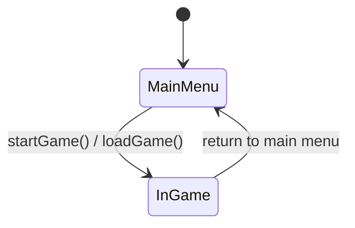

# Component: app

## Responsibility

The interactive entry point. Creates the GLFW window, manages Vulkan context lifetime,
runs the main game loop, handles all user input, routes unit selection, drains the
debug-server command queues on the main thread, and drives the turn processor and the
render pipeline. Built only when `AOC_HEADLESS=OFF`.

## Key files

- [include/aoc/app/Application.hpp](../../../include/aoc/app/Application.hpp) /
  `src/app/Application.cpp` — `Application`: owns `Window`, `GameState`, `HexGrid`,
  `EconomySimulation`, `DiplomacyManager`, `TurnManager`, the `AIController` vector,
  `BarbarianController`, `AllianceObligationTracker`, `GameRenderer`, `UIManager`,
  `ScreenRegistry`, the optional `DebugServer`, `ReplayRecorder`, `MusicManager` and the
  game RNG. It does not use `GameServer` or `GameClient`. `run()`
  ([src/app/Application.cpp:4660](../../../src/app/Application.cpp#L4660)) is the main
  loop: drain UI and game-control command queues ([:4714](../../../src/app/Application.cpp#L4714))
  → per-frame logic → `GameRenderer::render()` ([:5886](../../../src/app/Application.cpp#L5886))
  → `glfwPollEvents()`. `startGame` ([:2044](../../../src/app/Application.cpp#L2044))
  generates the map, places starts and spawns players; `handleEndTurn`
  ([:7111](../../../src/app/Application.cpp#L7111)) calls `processTurn`
  ([:7214](../../../src/app/Application.cpp#L7214)); `spectatorAdvanceTurn`
  ([:2410](../../../src/app/Application.cpp#L2410)) does the same for AI-only games.
- `src/app/Application_CityControl.cpp` — the REST game-control handlers: 23 route
  registrations (from [:81](../../../src/app/Application_CityControl.cpp#L81)) and the
  `executeGameControlCommand` overloads that turn a validated command into a request-layer
  call.
- `src/app/Application_HUD.cpp` — HUD construction and per-frame label updates (top bar,
  unit panel, city panel) split from `Application.cpp` for file-size management.
- `src/app/ApplicationHelpers.hpp` — small shared helpers for the three translation units.
- `src/app/Window.cpp` — GLFW window creation, Vulkan surface setup, swapchain resize.
- `src/app/InputManager.cpp` / [include/aoc/app/InputActions.hpp](../../../include/aoc/app/InputActions.hpp)
  — mouse and keyboard to named input actions; click-to-tile conversion via `CameraController`.
- `src/app/UnitSelection.cpp` — the selected unit/city and its move-preview overlay.
- `src/app/DebugCommandFile.cpp` — reads a text file of debug commands at startup.
- `src/app/ScreenshotEncoder.cpp` — framebuffer capture to PNG via `stb_image_write`.

## Public surface

`Application` is instantiated from `src/main.cpp:38` (the `age_of_civ` executable), which
parses `--spectate`, `--enable-debug-server`, `--players` and `--turns`, then calls
`initialize(config)` and `run()`. All other subsystems are created and owned by
`Application`; the dependency arrow is strictly outward, with one exception: `render`'s
`CameraController.cpp` includes `InputManager.hpp` for the action vocabulary.

## Internal structure

Flat directory. `Application.cpp` is deliberately large (the main loop is a single
translation unit) and delegates HUD work to `Application_HUD.cpp` and the REST handlers to
`Application_CityControl.cpp`. Commands arriving from the debug server thread are queued
under a mutex and executed only from `drainPendingCommands`
([src/app/Application.cpp:2996](../../../src/app/Application.cpp#L2996)) and
`drainPendingUiCommands` ([:3026](../../../src/app/Application.cpp#L3026)) on the main
thread.

<!-- arch-doc: class-diagram=skipped; one orchestrator class whose owned types belong to other components -->

## State machine

`AppState` ([include/aoc/app/Application.hpp:93](../../../include/aoc/app/Application.hpp#L93))
has two states. `initialize` starts in `MainMenu` (`src/app/Application.cpp:1980`);
`startGame` (`:2286`) and a successful load (`:4602`) enter `InGame`; returning to the menu
(`:6164`) goes back. `drainPendingCommands` ignores game commands outside `InGame`.

Anchors: `include/aoc/app/Application.hpp`, `src/app/Application.cpp`
