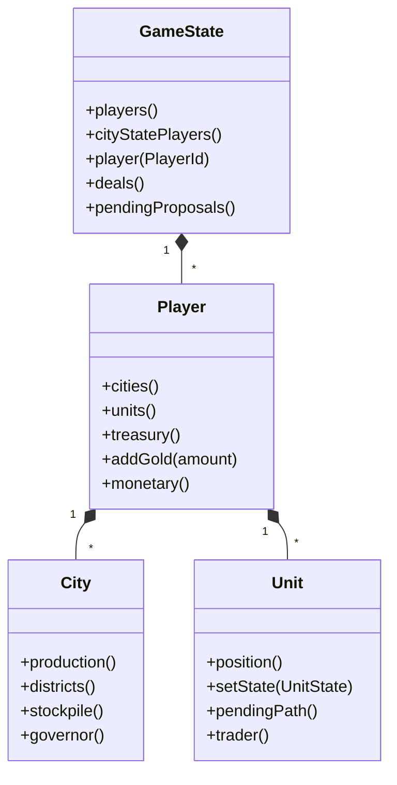

# Component: game

## Responsibility

Owns the runtime entity graph that all other subsystems read and write: the top-level
`GameState` container, `Player`, `City`, and `Unit` objects, plus zone-of-control queries.
This is the single source of truth for "what is currently happening in the game."

## Key files

- [include/aoc/game/GameState.hpp:64](../../../include/aoc/game/GameState.hpp#L64) —
  `GameState`: the root container. Owns `std::vector<unique_ptr<Player>>` for major
  players and a separate vector for city-state seats, plus the barbarian seat. Holds the
  global singletons (`GlobalClimateComponent`, `GlobalMonopolyComponent`,
  `GlobalSanctionTracker`, `GlobalWonderTracker`, `WorldCongressComponent`,
  `GlobalReligionTracker`, `VisibilityEventBus`) and the global collections: commodity
  hoards, barbarian clans, city states, electricity agreements, encampment supply buffers,
  the deal inbox (`pendingProposals()`) and, since v34, the deals in force (`deals()`).
- [include/aoc/game/Player.hpp:79](../../../include/aoc/game/Player.hpp#L79) — `Player`:
  owns its cities ([:409](../../../include/aoc/game/Player.hpp#L409)) and units
  ([:481](../../../include/aoc/game/Player.hpp#L481)), research state, the economy ledgers,
  government, religion and monetary components, and the `isHuman` flag. The one treasury is
  `monetary().treasury`, reached through `treasury()` / `addGold()` / `spendGold()`.
- [include/aoc/game/City.hpp:72](../../../include/aoc/game/City.hpp#L72) — `City`: owns
  production queue, citizens, districts and buildings, stockpiles, governor, loyalty and
  siege state.
- [include/aoc/game/Unit.hpp:34](../../../include/aoc/game/Unit.hpp#L34) — `Unit`:
  movement points, hit points, state, pending path, and the per-role components it
  carries (`trader()`, `spy()`, `greatPerson()`, `airUnit()`, experience) plus automation
  flags such as `autoRenewRoute`.
- [include/aoc/game/ZoneOfControl.hpp:23](../../../include/aoc/game/ZoneOfControl.hpp#L23)
  — `isInEnemyZoneOfControl(gameState, tile, player)`: the ZoC query, moved here from
  `simulation/unit`.

## Public surface

`GameState` is passed by reference to nearly every simulation function, the serializer and
the debug snapshot builder. Key access patterns:

- `gameState.player(PlayerId)` — look up a player by ID (major, city-state or barbarian seat)
- `gameState.humanPlayer()` / `setHumanPlayerId()` — which player the UI follows
- `gameState.players()` — iterate all major players (turn loop, victory check)
- `gameState.climate()`, `.worldCongress()`, `.religionTracker()`, `.monopoly()` — singletons
- `gameState.deals()`, `.pendingProposals()`, `.cityStates()`, `.barbarianClans()` — collections
- `gameState.recordTileEvent()` — the lightweight per-tile event stream

## Internal structure

Four entity types plus the ZoC query. Each entity type has one header and one source.
`GameState` aggregates all global state that has no natural owner among the player objects
— the "table" rather than any single chair. Fog of war lives in `map`
(`include/aoc/map/FogOfWar.hpp`), not here.

## Core types

`GameState` — [include/aoc/game/GameState.hpp:64](../../../include/aoc/game/GameState.hpp#L64);
`Player` — [include/aoc/game/Player.hpp:79](../../../include/aoc/game/Player.hpp#L79);
`City` — [include/aoc/game/City.hpp:72](../../../include/aoc/game/City.hpp#L72);
`Unit` — [include/aoc/game/Unit.hpp:34](../../../include/aoc/game/Unit.hpp#L34).

<!-- arch-doc: state-machines=none; UnitState is owned by simulation/unit and diagrammed there -->
