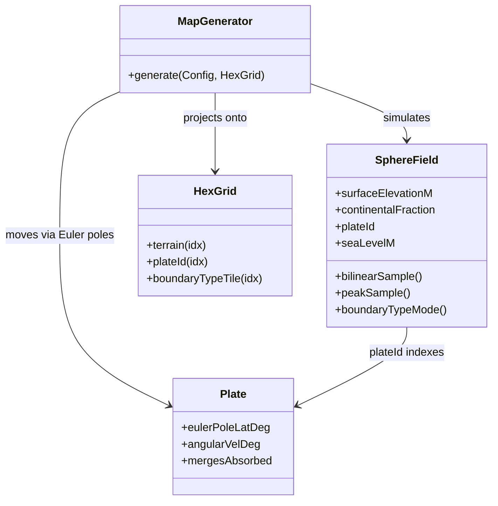

# Component: map

## Responsibility

Stores the hex tile grid and provides all geometry, terrain, pathfinding, fog of war, and
the full procedural map generator — a physics-first plate-tectonics simulation on a global
lat/lon raster, projected onto the hex grid and refined by climate/river/resource passes.

## Key files

- [include/aoc/map/HexGrid.hpp](../../../include/aoc/map/HexGrid.hpp) — `HexGrid`: flat
  SoA arrays indexed by `row * width + col` (odd-r offset coords); one contiguous
  `std::vector` per property. Two topologies: `Flat` and `Cylindrical` (east-west wrap).
  Carries worldgen output layers consumed downstream, including per-tile `plateId`
  and the plate-boundary classification `boundaryTypeTile`
  ([include/aoc/map/HexGrid.hpp:586](../../../include/aoc/map/HexGrid.hpp#L586), 0 none /
  1 convergent / 2 divergent / 3 transform) that drives margin classification, resource
  geology, and the renderer's plate-boundary overlay.
- [include/aoc/map/HexCoord.hpp](../../../include/aoc/map/HexCoord.hpp) — offset/axial
  conversion, neighbor enumeration, distance, rings.
- [include/aoc/map/Terrain.hpp](../../../include/aoc/map/Terrain.hpp) — `TerrainType`
  enum and per-terrain yield tables.
- [include/aoc/map/MapGenerator.hpp](../../../include/aoc/map/MapGenerator.hpp) —
  `MapGenerator`: top-level entry point. `Config` holds width/height/seed/`MapType`
  (only `Continents` is live)/`MapSize`/topology/projection/`tectonicTotalMy`/
  `seaLevelDelta`/`climatePhase` and related climate knobs. Sea level is NOT a config
  ratio — it is solved physically (below).
- [include/aoc/map/LandmassMetrics.hpp](../../../include/aoc/map/LandmassMetrics.hpp) —
  `computeLandmassSizes()` ([:23](../../../include/aoc/map/LandmassMetrics.hpp#L23)):
  per-tile connected-land-component sizes; used by `GameServer` and
  `HeadlessSimulation` to keep capital placement off sub-settleable islets.
- [include/aoc/map/Pathfinding.hpp](../../../include/aoc/map/Pathfinding.hpp) — A\* over
  the hex grid.
- [include/aoc/map/FogOfWar.hpp](../../../include/aoc/map/FogOfWar.hpp) — per-player
  visibility/explored bitsets.
- [include/aoc/map/RiverGameplay.hpp](../../../include/aoc/map/RiverGameplay.hpp) —
  river adjacency combat effects.

### Tectonic core (`SphereField` raster)

Authoritative worldgen state is `SphereField`
([include/aoc/map/gen/SphereField.hpp:40](../../../include/aoc/map/gen/SphereField.hpp#L40)):
a 720×360 (0.5°) lat/lon SoA raster — `surfaceElevationM`, `crustThicknessKm`,
`continentalFraction`, `plateId`, `convergenceRateRadPerMy`, `crustAgeMy`,
`thermalAgeMy`, `sutureContactMy`, `boundaryType` — plus the solved scalar `seaLevelM`
and the conserved water budget `oceanVolumeEquivDepthM`. Plates
([include/aoc/map/gen/Plate.hpp](../../../include/aoc/map/gen/Plate.hpp)) are rigid-motion
parameterisations (Euler pole + angular velocity) whose footprints live in the raster's
`plateId`.

Per-epoch physics pass order (`stepSpherePhysicsEpoch`,
[src/map/gen/SphereFieldPhysics.cpp](../../../src/map/gen/SphereFieldPhysics.cpp)):

1. `advectPlateOwnership` ([:941](../../../src/map/gen/SphereFieldPhysics.cpp#L941)) —
   backward semi-Lagrangian transport, CFL sub-stepped; incumbent-wins conflict rule;
   trailing-edge wake becomes fresh ridge basalt owned by the vacating plate; rotation
   aliasing echoes re-target adjacent orphan sources (area-preserving pairing).
2. boundary detection + `accumulateClosingRate` — closing/shear decomposition against the
   true local boundary normal (5×5 indicator-gradient, cos-lat weighted).
3. `thickenFromClosingRate` — convergent continental thickening (orogeny).
4. `growContinentalFractionAtArcs` — arc volcanism inboard of trenches, plus tectonic
   erosion of the overriding trench margin (the continental-area sink).
5. `accreteToNeighbours` ([:1747](../../../src/map/gen/SphereFieldPhysics.cpp#L1747)) —
   isotropic 8-neighbour terrane-accretion diffusion from saturated continental cells.
6. `applySubduction` ([:1853](../../../src/map/gen/SphereFieldPhysics.cpp#L1853)) —
   consumption as a budget-propagating front peel (local closing-rate budgets, coherent
   front advance, continental arrest; kinematic cap from the plate-speed ceiling).
7. `accreteAtDivergentBoundary` — mid-ocean-ridge crust reset (age 0).
8. `applyContinentalDocking` ([:2218](../../../src/map/gen/SphereFieldPhysics.cpp#L2218))
   — plates weld after sustained cont-cont convergent suture contact (per-cell
   `sutureContactMy` clock; ≥16 cells at ≥250 My and >0.002 rad/My).
9. `applySlabPullFeedback` — convergence-driven angular-velocity nudges.
10. `applyWilsonRifting` ([:479](../../../src/map/gen/SphereFieldPhysics.cpp#L479)) —
    thermal-age supercontinent breakup; PCA split with a log-normal fragment-share
    quantile and a noise-meandered sinuous seam carved to fresh ocean.
11. `enforcePlateContiguity` ([:2069](../../../src/map/gen/SphereFieldPhysics.cpp#L2069))
    — each plate keeps its largest connected component; small stranded fragments
    transfer to the longest-border neighbour (size-capped terrane transfer).
12. `recomputeIsostaticElevationOnRaster`
    ([:2308](../../../src/map/gen/SphereFieldPhysics.cpp#L2308)) — Airy compensation
    plus age-dependent oceanic thermal subsidence (Stein & Stein half-space cooling,
    weighted `(1-cf)^2`).
13. `solveSeaLevelFixedVolume`
    ([:2348](../../../src/map/gen/SphereFieldPhysics.cpp#L2348)) — sea level as the
    stand at which the conserved ocean volume fills the current hypsometry (serial
    bisection; the climate phase perturbs the water budget).
14. `applySurfaceErosionOnRaster` — slope-based stream power grading toward a peneplain
    floor 600 m above the solved sea level.
15. `compactPlateList` / `recomputePlateCentroidsFromCells`.

### Generator pipeline (`src/map/MapGenerator.cpp` + `src/map/gen/`)

Craton seeding (anisotropic elliptical stochastic growth, lognormal-partitioned total
stock) → initial plate ownership by stochastic region growing (no Voronoi) → 60 × 50 My
physics epochs (above) → hex projection (bilinear elevation relative to `seaLevelM`,
`peakSample` mountain gate at 4000 m above sea level
([include/aoc/map/gen/SphereField.hpp:38](../../../include/aoc/map/gen/SphereField.hpp#L38)),
deterministic sub-grid coastal detail noise via `smoothHashNoise3`
([include/aoc/map/gen/Noise.hpp](../../../include/aoc/map/gen/Noise.hpp)), footprint-mode
`boundaryTypeTile`, hex-level plate-contiguity cleanup) → `PostSim` (sediment, and
active/passive margin classification: a coast within 1 hex of a convergent boundary tile
is Andean-type, else Atlantic-type with wide shelf) → `Thresholds`
([src/map/gen/Thresholds.cpp:19](../../../src/map/gen/Thresholds.cpp#L19), land/water cut
at solved sea level, shiftable by `seaLevelDelta`) → `ClimateBiome`/Köppen → rivers →
features → island/lake purges + coastal erosion (softened to preserve archipelagos;
capitals guarded by `computeLandmassSizes`) → resources → chokepoints.

## Public surface

- `MapGenerator::generate(config, outGrid)` — called by `GameServer::initialize()`,
  `HeadlessSimulation`, and `aoc_mapgen`.
- `HexGrid` accessors — read/written by simulation, render, save, net.
- `computeLandmassSizes(grid)` — start-placement guard (net + tools).
- `Pathfinding::findPath(...)`, `HexCoord`/`AxialCoord` utilities.

## Internal structure

Top-level files own grid storage/geometry/gameplay; `gen/` holds the worldgen pipeline as
one header/source pair per stage sharing a `MapGenContext`. Verification tooling:
`AOC_SPHEREPHYS_TRACE`, `AOC_DUMP_THRESHOLD`, `AOC_DUMP_MARGINS` env diagnostics;
`tools/mapgen_metrics.py` (land fraction, coastline box-dimension, orientation, landmass
elongation, per-plate contiguity) with committed per-phase baselines under
`tools/mapgen_baselines/`.

## Core types

`MapGenerator` — [include/aoc/map/MapGenerator.hpp](../../../include/aoc/map/MapGenerator.hpp);
`SphereField` — [include/aoc/map/gen/SphereField.hpp:40](../../../include/aoc/map/gen/SphereField.hpp#L40);
`Plate` — [include/aoc/map/gen/Plate.hpp](../../../include/aoc/map/gen/Plate.hpp);
`HexGrid` — [include/aoc/map/HexGrid.hpp](../../../include/aoc/map/HexGrid.hpp).

<!-- arch-doc: state-machines=none; no transitioned enum found in map -->
