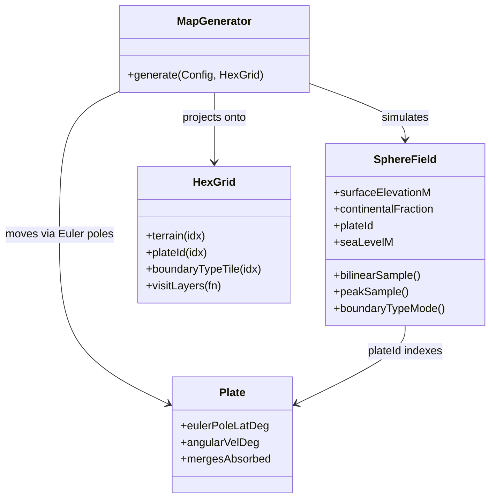

# Component: map

## Responsibility

Stores the hex tile grid and provides all geometry, terrain, pathfinding, fog of war, start
placement, and the full procedural map generator — a physics-first plate-tectonics
simulation on a global lat/lon raster, projected onto the hex grid and refined by
climate/river/lake/resource passes.

## Key files

- [include/aoc/map/HexGrid.hpp](../../../include/aoc/map/HexGrid.hpp) — `HexGrid`: flat
  SoA arrays indexed by `row * width + col` (odd-r offset coords); one contiguous
  `std::vector` per property. Two topologies: `Flat` and `Cylindrical` (east-west wrap).
  Carries worldgen output layers consumed downstream, including per-tile `plateId` and the
  plate-boundary classification `boundaryTypeTile`
  ([:749](../../../include/aoc/map/HexGrid.hpp#L749), 0 none / 1 convergent / 2 divergent /
  3 transform) that drives margin classification, resource geology, and the renderer's
  plate-boundary overlay.
- [include/aoc/map/HexGridLayers.hpp](../../../include/aoc/map/HexGridLayers.hpp) —
  `HexGrid::visitLayers()`: every container layer of the grid by name; the save format and
  the `.aocmap` cache iterate it instead of naming layers by hand.
- [include/aoc/map/StartPlacement.hpp](../../../include/aoc/map/StartPlacement.hpp) —
  `chooseStartPositions(grid, playerCount, rng)`: the start-position picker shared by the
  graphical game (`src/app/Application.cpp:2177`) and the headless simulator
  (`src/tools/HeadlessSimulation.cpp:455`).
- [include/aoc/map/HexCoord.hpp](../../../include/aoc/map/HexCoord.hpp) — offset/axial
  conversion, neighbor enumeration, distance, rings.
- [include/aoc/map/Terrain.hpp](../../../include/aoc/map/Terrain.hpp) — `TerrainType`
  enum and per-terrain yield tables.
- [include/aoc/map/MapGenerator.hpp](../../../include/aoc/map/MapGenerator.hpp) —
  `MapGenerator`: top-level entry point. `Config` holds width/height/seed/`MapType`
  (only `Continents` is live)/`MapSize`/topology/projection/`tectonicTotalMy`/
  `seaLevelDelta`/`climatePhase`/`ResourcePlacementMode` (Realistic, Fair, Random). Sea
  level is not a config ratio — it is solved physically (below).
- [include/aoc/map/LandmassMetrics.hpp:33](../../../include/aoc/map/LandmassMetrics.hpp#L33)
  — `computeLandmassSizes()`: per-tile connected-land-component sizes used by start
  placement to keep capitals off sub-settleable islets.
- [include/aoc/map/Pathfinding.hpp](../../../include/aoc/map/Pathfinding.hpp) — A\* over
  the hex grid (reads `GameState` for ownership, hence the `map → game` include edge).
- [include/aoc/map/FogOfWar.hpp](../../../include/aoc/map/FogOfWar.hpp) — per-player
  visibility/explored bitsets.
- [include/aoc/map/RiverGameplay.hpp](../../../include/aoc/map/RiverGameplay.hpp) —
  river adjacency combat effects.

### Tectonic core (`SphereField` raster)

Authoritative worldgen state is `SphereField`
([include/aoc/map/gen/SphereField.hpp:116](../../../include/aoc/map/gen/SphereField.hpp#L116)):
a 720×360 (0.5°) lat/lon SoA raster — elevation, crust thickness, continental fraction,
`plateId`, convergence rate, crust and thermal ages, suture contact, boundary type — plus the
solved scalar sea level and the conserved ocean-volume budget. Plates
([include/aoc/map/gen/Plate.hpp](../../../include/aoc/map/gen/Plate.hpp)) are rigid-motion
parameterisations (Euler pole + angular velocity) whose footprints live in the raster's
`plateId`. Continental crust additionally rides as rigid terranes
([include/aoc/map/gen/Terrane.hpp](../../../include/aoc/map/gen/Terrane.hpp)) on a
prescribed Wilson-cycle schedule
([include/aoc/map/gen/WilsonSchedule.hpp](../../../include/aoc/map/gen/WilsonSchedule.hpp)).

Per-epoch physics pass (`stepSpherePhysicsEpoch`,
[src/map/gen/SphereFieldPhysics.cpp:4525](../../../src/map/gen/SphereFieldPhysics.cpp#L4525)),
in order: plate-ownership advection (`advectPlateOwnership`,
[:1183](../../../src/map/gen/SphereFieldPhysics.cpp#L1183)); boundary detection and closing
rate; convergent thickening; arc volcanism; terrane accretion (`accreteToNeighbours`,
[:2189](../../../src/map/gen/SphereFieldPhysics.cpp#L2189)); subduction as a
budget-propagating front (`applySubduction`,
[:2832](../../../src/map/gen/SphereFieldPhysics.cpp#L2832)); ridge crust reset; continental
docking (`applyContinentalDocking`,
[:3192](../../../src/map/gen/SphereFieldPhysics.cpp#L3192)); slab-pull feedback; Wilson
rifting and plate-contiguity enforcement (same file); Airy isostasy with thermal subsidence
(`recomputeIsostaticElevationOnRaster`,
[:3401](../../../src/map/gen/SphereFieldPhysics.cpp#L3401)); the fixed-volume sea level
(`solveSeaLevelFixedVolume`, [:3848](../../../src/map/gen/SphereFieldPhysics.cpp#L3848));
surface erosion; plate-list compaction. Per-tile passes run under OpenMP when available.

### Generator pipeline (`src/map/MapGenerator.cpp` + `src/map/gen/`)

Craton seeding → initial plate ownership → physics epochs (above) → hex projection
(bilinear elevation relative to the solved sea level, sub-grid coastal noise via
[include/aoc/map/gen/Noise.hpp](../../../include/aoc/map/gen/Noise.hpp), footprint-mode
`boundaryTypeTile`) → `PostSim` (sediment, active/passive margins) → `Thresholds`
([src/map/gen/Thresholds.cpp:19](../../../src/map/gen/Thresholds.cpp#L19), land/water cut at
solved sea level, shiftable by `seaLevelDelta`) → `Relief` → `ClimateBiome`/Köppen and the
biogeography layers → rivers → `Lakes` (endorheic basins) → features → island/lake purges
and coastal erosion → resources (`Resources.cpp`: geology-clustered placement, a strategic
backstop, and the Fair-mode quadrant balance) → chokepoints.

## Public surface

- `MapGenerator::generate(config, outGrid)` — called by `Application::startGame`,
  `HeadlessSimulation`, and `aoc_mapgen`.
- `chooseStartPositions(grid, n, rng)` — the game and the headless tool.
- `HexGrid` accessors and `visitLayers` — read/written by simulation, render, save, debug.
- `computeLandmassSizes(grid)`, `Pathfinding::findPath(...)`, `HexCoord`/`AxialCoord` utilities.

## Internal structure

Top-level files own grid storage/geometry/gameplay; `gen/` holds the worldgen pipeline as
one header/source pair per stage (33 sources) sharing a `MapGenContext`. Verification
tooling: `AOC_SPHEREPHYS_TRACE`, `AOC_DUMP_THRESHOLD`, `AOC_DUMP_MARGINS`,
`AOC_DUMP_OROGENY` env diagnostics; `tools/mapgen_metrics.py` with committed per-phase
baselines under `tools/mapgen_baselines/`.

## Core types

`MapGenerator` — [include/aoc/map/MapGenerator.hpp](../../../include/aoc/map/MapGenerator.hpp);
`SphereField` — [include/aoc/map/gen/SphereField.hpp:116](../../../include/aoc/map/gen/SphereField.hpp#L116);
`Plate` — [include/aoc/map/gen/Plate.hpp](../../../include/aoc/map/gen/Plate.hpp);
`HexGrid` — [include/aoc/map/HexGrid.hpp](../../../include/aoc/map/HexGrid.hpp).

<!-- arch-doc: state-machines=none; ResourcePlacementMode and BrushMode are configuration enums, never transitioned -->
