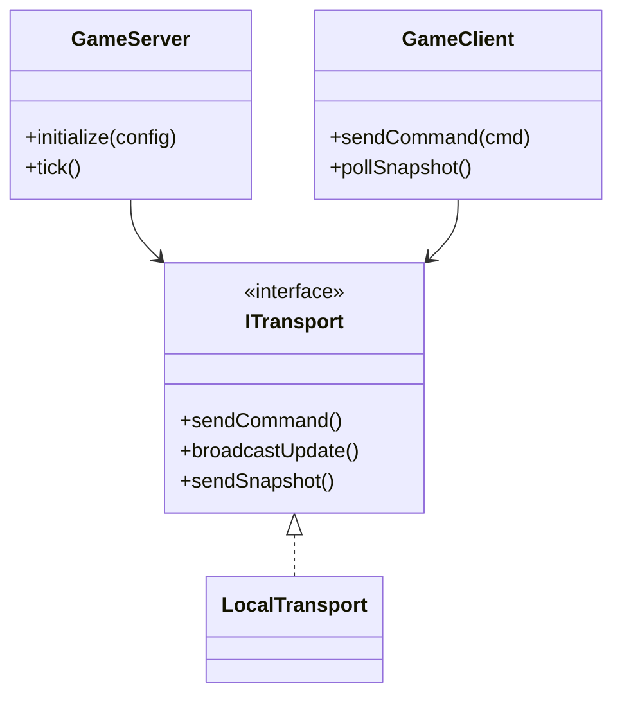

# Component: net

## Responsibility

Defines a server/client game architecture and the transport layer that would connect
them, plus the Linux D-Bus desktop integration. The server/client path is compiled into
`aoc_lib` but no executable instantiates it today: `Application` and `HeadlessSimulation`
both drive `TurnProcessor` directly.

## Key files

- [include/aoc/net/GameServer.hpp:51](../../../include/aoc/net/GameServer.hpp#L51) —
  `GameServer`: owns `GameState`, `HexGrid`, `EconomySimulation`, `DiplomacyManager`,
  `TurnManager`, `Random`, and the `AIController` vector; `tick()` consumes pending
  commands from `ITransport`, validates them, and — when all human players have sent
  `EndTurn` — calls `processTurn()`, then broadcasts per-player `GameStateSnapshot`s.
- [include/aoc/net/GameClient.hpp:26](../../../include/aoc/net/GameClient.hpp#L26) —
  `GameClient`: typed `sendCommand()` helpers and snapshot/update polling.
- [include/aoc/net/Transport.hpp:55](../../../include/aoc/net/Transport.hpp#L55) —
  `ITransport` abstract interface (commands → server, state updates → clients, snapshots →
  one client); `LocalTransport`
  ([:92](../../../include/aoc/net/Transport.hpp#L92)) implements it with in-process vectors
  and asserts single-thread ownership in debug builds.
- [include/aoc/net/NetInterface.hpp:28](../../../include/aoc/net/NetInterface.hpp#L28) —
  `NetInterface` (older abstract interface) and the `NetworkMode` enum.
- [include/aoc/net/CommandBuffer.hpp](../../../include/aoc/net/CommandBuffer.hpp),
  [StateUpdate.hpp](../../../include/aoc/net/StateUpdate.hpp),
  [GameStateSnapshot.hpp](../../../include/aoc/net/GameStateSnapshot.hpp) — the command
  variant, the per-action delta message, and the per-player full-state view.
- [include/aoc/net/GameDBus.hpp](../../../include/aoc/net/GameDBus.hpp) /
  `src/net/GameDBus.cpp` — D-Bus IPC for Linux desktop integration (taskbar progress,
  rich presence); compiled only when sdbus-cpp is detected; owned by `Application`.

## Public surface

- `GameServer::initialize(config)` / `tick()` and `GameClient` — declared and implemented,
  referenced outside `src/net/` only by a comment in `src/simulation/turn/TurnProcessor.cpp:1721`.
  The interactive end-turn path is `src/app/Application.cpp:7214` and the headless one
  `src/tools/HeadlessSimulation.cpp:685`, both calling `processTurn` without a transport.
- `GameDBus` — used by `Application`.

## Internal structure

Flat directory. The server/client split mirrors what a multiplayer server would need; the
in-process `LocalTransport` is its only implementation.

## Core types

`GameServer` — [include/aoc/net/GameServer.hpp:51](../../../include/aoc/net/GameServer.hpp#L51);
`GameClient` — [include/aoc/net/GameClient.hpp:26](../../../include/aoc/net/GameClient.hpp#L26);
`ITransport` — [include/aoc/net/Transport.hpp:55](../../../include/aoc/net/Transport.hpp#L55);
`LocalTransport` — [include/aoc/net/Transport.hpp:92](../../../include/aoc/net/Transport.hpp#L92).

<!-- arch-doc: state-machines=none; NetworkMode is a configuration enum, never transitioned -->
