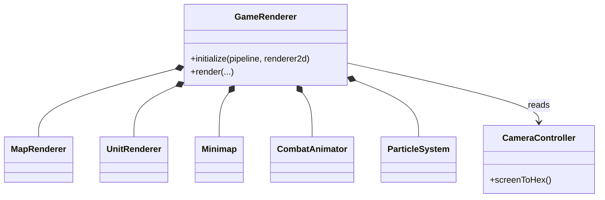

# Component: render

## Responsibility

Drives all Vulkan rendering: the hex map, unit sprites, combat animations, globe view,
minimap, overlays, per-player colours, and the 2D sprite/particle layer. Excluded entirely
in headless builds (`AOC_HEADLESS=ON`).

## Key files

- [include/aoc/render/GameRenderer.hpp:60](../../../include/aoc/render/GameRenderer.hpp#L60)
  — `GameRenderer`: top-level orchestrator owning `MapRenderer`, `UnitRenderer`,
  `Minimap`, `CombatAnimator`, `ParticleSystem` and the `TooltipManager`
  ([:81-86](../../../include/aoc/render/GameRenderer.hpp#L81)). `render()` takes a
  `VkCommandBuffer`, `CameraController`, `HexGrid`, `GameState` and `FogOfWar` and sequences
  the sub-renderers.
- [include/aoc/render/MapRenderer.hpp:26](../../../include/aoc/render/MapRenderer.hpp#L26)
  — per-tile terrain, feature, improvement and district rendering from `HexGrid`.
- [include/aoc/render/UnitRenderer.hpp:31](../../../include/aoc/render/UnitRenderer.hpp#L31)
  — unit sprites at their tile positions with move/attack highlights.
- [include/aoc/render/MapOverlays.hpp:47](../../../include/aoc/render/MapOverlays.hpp#L47)
  — `OverlayState`: yields, political borders, appeal, religion, climate and trade-route
  overlays.
- [include/aoc/render/Minimap.hpp:28](../../../include/aoc/render/Minimap.hpp#L28) —
  minimap in a framed corner widget; updates on territory and fog changes.
- [include/aoc/render/CombatAnimation.hpp:27](../../../include/aoc/render/CombatAnimation.hpp#L27)
  — `CombatAnimator`: interpolates positions and hit flashes during combat resolution.
- [include/aoc/render/Particles.hpp:33](../../../include/aoc/render/Particles.hpp#L33) —
  `ParticleSystem`: CPU particles (smoke, sparks, banners).
- [include/aoc/render/PlayerColors.hpp](../../../include/aoc/render/PlayerColors.hpp) —
  the per-player colour table shared by map, minimap and UI.
- [include/aoc/render/GlobeRenderer.hpp](../../../include/aoc/render/GlobeRenderer.hpp),
  [SpriteRenderer.hpp](../../../include/aoc/render/SpriteRenderer.hpp),
  [TextureAtlas.hpp](../../../include/aoc/render/TextureAtlas.hpp),
  [DrawCommandBuffer.hpp](../../../include/aoc/render/DrawCommandBuffer.hpp) — globe view,
  2D sprite batching, the single GPU texture atlas, and draw-call batching.
- [include/aoc/render/CameraController.hpp:19](../../../include/aoc/render/CameraController.hpp#L19)
  — pan/zoom state and screen-to-hex conversion; its source includes `app/InputManager.hpp`
  for the action vocabulary (the `render → app` edge).

## Public surface

- `GameRenderer::initialize(pipeline, renderer2d)` — called once by `Application`
  (`src/app/Application.cpp:365`).
- `GameRenderer::render(...)` — called every frame (`src/app/Application.cpp:5886`).
- `CameraController` — read by `GameRenderer`, `InputManager` and `ui/Tooltip`.
- `PlayerColors` — read by `ui`.

## Internal structure

Flat directory: one class per file. All rendering goes through `vulkan_app::RenderPipeline`
and `vulkan_app::renderer::Renderer2D` from the `vulkan_renderer` submodule. The render
subsystem reads `HexGrid` and `GameState` as const references; it never writes game data.

## Core types

`GameRenderer` — [include/aoc/render/GameRenderer.hpp:60](../../../include/aoc/render/GameRenderer.hpp#L60);
`MapRenderer` — [include/aoc/render/MapRenderer.hpp:26](../../../include/aoc/render/MapRenderer.hpp#L26);
`UnitRenderer` — [include/aoc/render/UnitRenderer.hpp:31](../../../include/aoc/render/UnitRenderer.hpp#L31);
`Minimap` — [include/aoc/render/Minimap.hpp:28](../../../include/aoc/render/Minimap.hpp#L28);
`CombatAnimator` — [include/aoc/render/CombatAnimation.hpp:27](../../../include/aoc/render/CombatAnimation.hpp#L27);
`ParticleSystem` — [include/aoc/render/Particles.hpp:33](../../../include/aoc/render/Particles.hpp#L33);
`CameraController` — [include/aoc/render/CameraController.hpp:19](../../../include/aoc/render/CameraController.hpp#L19).

<!-- arch-doc: state-machines=none; no transitioned enum found -->
