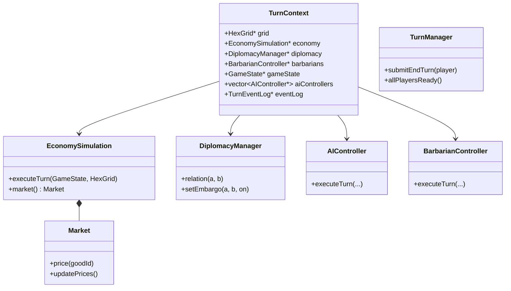
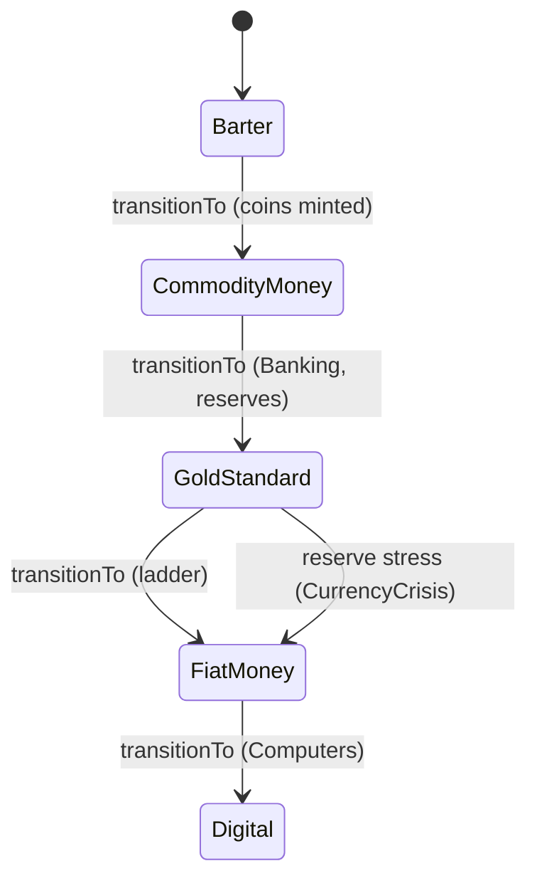
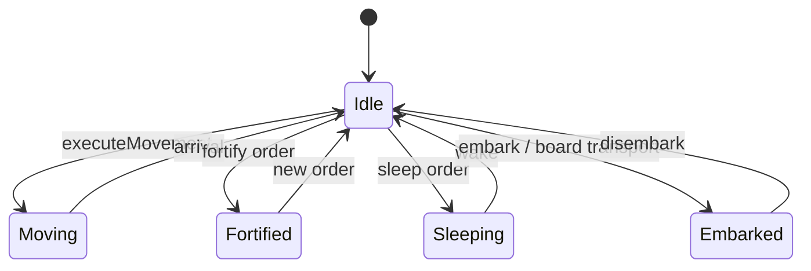
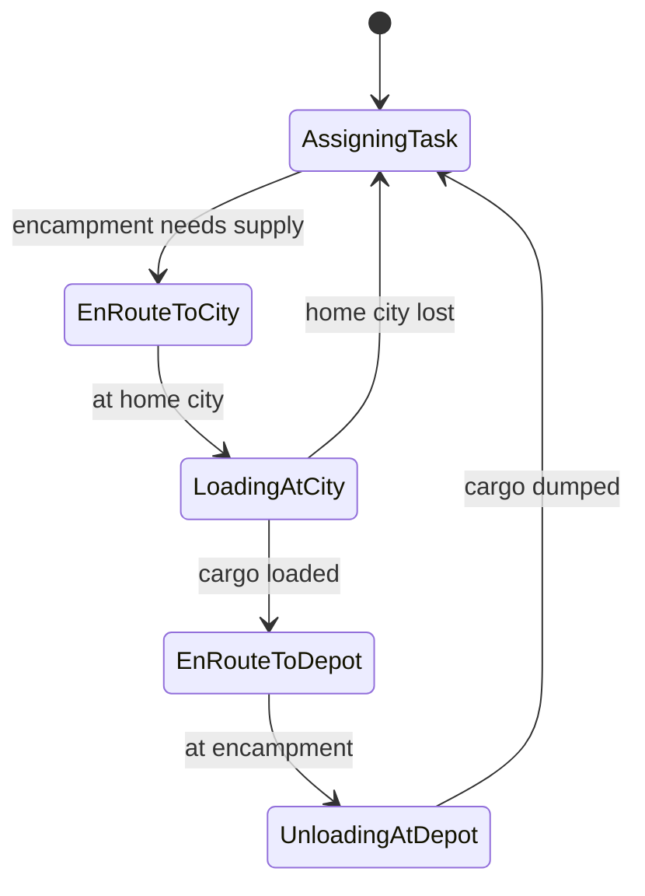
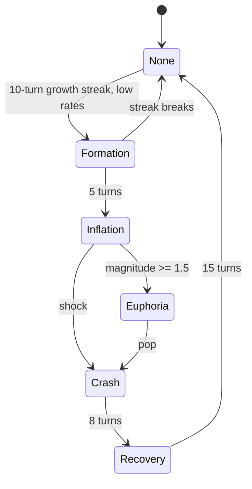

# Component: simulation

## Responsibility

The game's domain layer. Contains all rules that advance game state from one turn to the
next: AI decisions, economic production, diplomacy, city and unit mechanics, technology,
religion, culture, government, monetary policy, victory evaluation, and the `TurnProcessor`
that sequences them all.

## Key files

- [include/aoc/simulation/turn/TurnProcessor.hpp:172](../../../include/aoc/simulation/turn/TurnProcessor.hpp#L172)
  — `processTurn(TurnContext&)`: the single function called by `Application`
  (`src/app/Application.cpp:7214`) and `HeadlessSimulation` (`src/tools/HeadlessSimulation.cpp:685`)
  to advance one turn. `TurnContext` ([:77](../../../include/aoc/simulation/turn/TurnProcessor.hpp#L77))
  carries pointers to the grid, optional fog, `EconomySimulation`, `DiplomacyManager`,
  `BarbarianController`, `AllianceObligationTracker`, RNG, `GameState`, the AI controllers,
  the seat list, an optional `TurnEventLog` and an optional `DecisionLog`. The deals in
  force are read from `GameState::deals()` (v34), not from the context.
- [include/aoc/simulation/resource/EconomySimulation.hpp:32](../../../include/aoc/simulation/resource/EconomySimulation.hpp#L32)
  — `EconomySimulation::executeTurn()`: harvest raw resources → depletion → internal trade
  → building fuel → production recipes in DAG order → market report → needs → prices →
  monetary policy. Owns the global `Market`
  ([include/aoc/simulation/economy/Market.hpp:22](../../../include/aoc/simulation/economy/Market.hpp#L22)).
- [include/aoc/simulation/diplomacy/DiplomacyState.hpp:224](../../../include/aoc/simulation/diplomacy/DiplomacyState.hpp#L224)
  — `DiplomacyManager`: NxN relation-score matrix with decaying `RelationModifier` records,
  directional embargoes, and `DiplomaticStance` derived from score bands.
- [include/aoc/simulation/BalanceConfig.hpp](../../../include/aoc/simulation/BalanceConfig.hpp)
  — `aoc::sim::balance` namespace: compile-time balance constants grouped by system.
  Overridden at runtime by `BalanceParams` from the balance/ml subsystem.
- Request layer — one validated entry per mutation, shared by the human UI, the AI, the
  REST API and the MCP tools: `city/CityActions.hpp`, `unit/UnitOrders.hpp`,
  `unit/AttackRequest.hpp`, `unit/BuilderActions.hpp`, `diplomacy/DiplomacyActions.hpp`,
  `diplomacy/DealProposals.hpp`, `monetary/MonetaryActions.hpp`.

### Sub-module index

| Sub-module | Key files | What it does |
|---|---|---|
| `ai/` | `AIController.cpp`, `AIDiplomacyController.cpp`, `AIMilitaryController.cpp`, `AISettlerController.cpp`, `AITradeRoutesController.cpp`, `AIEconomicStrategy.cpp`, `LeaderPersonality.cpp`, `TunedLeaderIO.cpp`, `UtilityScoring.cpp`, … (18 files) | One `AIController` per AI seat orchestrating focused controllers via utility scoring; tuned leader genomes read through `TunedLeaderIO` |
| `economy/` | `Market.cpp`, `TradeRouteSystem.cpp`, `Maintenance.cpp`, `InternalTrade.cpp`, `TradeAgreement.cpp`, `MonopolyPricing.cpp`, `Sanctions.cpp`, `SpeculationBubble.cpp`, `DomesticCourier.cpp`, `EnergyDependency.cpp`, … (23 files) | Global commodity market, physical Trader routes with cargo, tolls and coin, gold income and maintenance, sanctions, monopolies, bubbles, energy |
| `diplomacy/` | `DiplomacyState.cpp`, `DiplomacyActions.cpp`, `DealTerms.cpp`, `DealProposals.cpp`, `EspionageSystem.cpp`, `WorldCongress.cpp`, `Grievance.cpp`, `WarWeariness.cpp`, `AllianceObligations.cpp`, `DiplomaticFavor.cpp`, `NavalPassage.cpp`, `BorderViolation.cpp` | Pairwise relations, deal terms and the human inbox, espionage, World Congress, grievances, alliances |
| `city/` | `CityGrowth.cpp`, `CityScience.cpp`, `CityLoyalty.cpp`, `CitySiege.cpp`, `CityActions.cpp`, `DistrictPlacement.cpp`, `DistrictAdjacency.cpp`, `ProductionSystem.cpp`, `Governor.cpp`, `Happiness.cpp`, `BorderExpansion.cpp`, `CityConnection.cpp`, `Secession.cpp`, `CityBombardment.cpp` | City lifecycle: growth, science, loyalty, siege, districts on real tiles, production queue, governors, amenities |
| `unit/` | `Combat.cpp`, `Movement.cpp`, `UnitOrders.cpp`, `AttackRequest.cpp`, `BuilderActions.cpp`, `UnitTransport.cpp`, `Naval.cpp`, `Promotion.cpp`, `UnitUpgrade.cpp`, `SupplyLines.cpp`, `CombatExtensions.cpp` | Combat resolution, movement, orders, builder actions, embark/transport, promotions, upgrades, supply |
| `tech/` | `TechTree.cpp`, `CivicTree.cpp`, `CivicEffects.cpp`, `EurekaBoost.cpp`, `TechGating.cpp`, `EraScore.cpp` | Research and civic trees, civic effects, Eureka triggers, era score, tech-gated unlocks |
| `religion/` | `Religion.cpp` | Faith, pantheons, founding and spread, beliefs, theological combat |
| `culture/` | `Tourism.cpp`, `GreatWorks.cpp` | Tourism and the culture victory counter; great works and their housing |
| `government/` | `Government.cpp` | Policy slots, anarchy, government-type modifiers |
| `production/` | `Automation.cpp`, `PowerGrid.cpp`, `QualityTier.cpp`, `Waste.cpp` | Robot workers, electricity grid and plant fuel, quality tiers, waste |
| `resource/` | `EconomySimulation.cpp`, `ProductionChain.cpp`, `ResourceTypes.cpp` | The per-turn economy driver, recipe DAG, 167 goods |
| `monetary/` | `MonetaryActions.cpp`, `Inflation.cpp`, `CentralBank.cpp`, `FiscalPolicy.cpp`, `CurrencyTrust.cpp`, `CurrencyCrisis.cpp`, `CurrencyWar.cpp`, `ForexMarket.cpp`, `Bonds.cpp` | The monetary-regime ladder, inflation, trust, crises, forex, bonds; `MonetarySystem.hpp` is header-only |
| `barbarian/` | `BarbarianClans.cpp`, `BarbarianController.cpp` | Clans, camps, raids |
| `citystate/` | `CityState.cpp` (+ `Envoys.hpp`) | City-state types, envoys, suzerainty, quests |
| `climate/` | `Climate.cpp`, `NaturalDisasters.cpp` | CO₂, temperature, disasters |
| `event/` | `VisibilityEvents.cpp`, `GameNotifications.cpp`, `WorldEvents.cpp` | Visibility bus, notifications, world events |
| `wonder/` | `Wonder.cpp` | Wonder tracking and effects |
| `victory/` | `VictoryCondition.cpp`, `Prestige.cpp`, `SpaceRace.cpp` | Victory evaluation |
| `greatpeople/` | `GreatPeople.cpp`, `GreatPeopleExpanded.cpp` | Great person points, recruitment, activation |
| `map/` | `Improvement.cpp`, `TerrainModification.cpp`, `Chokepoint.cpp`, `GoodyHuts.cpp` | Improvements, terrain projects, chokepoints, ruins |
| `empire/` | `CommunicationSpeed.cpp` | Empire-scale communication delay |
| `turn/` | `TurnProcessor.cpp`, `TurnManager.cpp` | Turn sequencing; `TurnManager` holds the turn counter and end-turn readiness |
| `automation/` | `Automation.cpp` | Auto-renewed trade routes and other standing automation |

## Public surface

All sub-modules are called from `processTurn()`. External callers:
- `Application` and `HeadlessSimulation` — call `processTurn()`; the UI reads `Market`
  prices, stances, research and production state through the request layer's query side.
- `save/Serializer` — serializes every simulation state struct to binary sections.
- `debug` / `tools/mcp_server.py` — every mutation route ends in one request-layer function.

## Internal structure

Each sub-module is a directory under `src/simulation/` mirrored in
`include/aoc/simulation/`. Dependencies flow inward (sub-modules read `game::GameState` and
`map::HexGrid`); the exception is three AI controller headers that include
`aoc/ui/MainMenu.hpp` for its setup types. `turn/TurnProcessor` is the single integration
point that orchestrates the others in the documented order.

## Core types

`TurnContext` — [include/aoc/simulation/turn/TurnProcessor.hpp:77](../../../include/aoc/simulation/turn/TurnProcessor.hpp#L77);
`EconomySimulation` — [include/aoc/simulation/resource/EconomySimulation.hpp:32](../../../include/aoc/simulation/resource/EconomySimulation.hpp#L32);
`Market` — [include/aoc/simulation/economy/Market.hpp:22](../../../include/aoc/simulation/economy/Market.hpp#L22);
`DiplomacyManager` — [include/aoc/simulation/diplomacy/DiplomacyState.hpp:224](../../../include/aoc/simulation/diplomacy/DiplomacyState.hpp#L224);
`AIController` — [include/aoc/simulation/ai/AIController.hpp:57](../../../include/aoc/simulation/ai/AIController.hpp#L57);
`BarbarianController` — [include/aoc/simulation/barbarian/BarbarianController.hpp:44](../../../include/aoc/simulation/barbarian/BarbarianController.hpp#L44);
`TurnManager` — [include/aoc/simulation/turn/TurnManager.hpp:29](../../../include/aoc/simulation/turn/TurnManager.hpp#L29);
`TurnEventLog` — [include/aoc/simulation/turn/TurnEventLog.hpp:65](../../../include/aoc/simulation/turn/TurnEventLog.hpp#L65).

## State machines

**Monetary regime** — `MonetarySystemType`
([include/aoc/simulation/monetary/MonetarySystem.hpp:50](../../../include/aoc/simulation/monetary/MonetarySystem.hpp#L50)).
The ladder is gated by the `MONETARY_TRANSITIONS` table ([:223](../../../include/aoc/simulation/monetary/MonetarySystem.hpp#L223))
through `canTransition` ([:533](../../../include/aoc/simulation/monetary/MonetarySystem.hpp#L533))
and `transitionTo` ([:593](../../../include/aoc/simulation/monetary/MonetarySystem.hpp#L593)).
Callers: the per-turn ladder in `src/simulation/resource/EconomySimulation.cpp:1422`, the AI's
own advance in `src/simulation/ai/AIController.cpp:2212`, and the forced suspension of
convertibility in `src/simulation/monetary/CurrencyCrisis.cpp:328`.

Anchors: `include/aoc/simulation/monetary/MonetarySystem.hpp`, `src/simulation/resource/EconomySimulation.cpp`, `src/simulation/ai/AIController.cpp`, `src/simulation/monetary/CurrencyCrisis.cpp`

**Unit state** — `UnitState`
([include/aoc/simulation/unit/UnitTypes.hpp:39](../../../include/aoc/simulation/unit/UnitTypes.hpp#L39)),
set unconditionally through `Unit::setState`. Sites: `Moving` in
`src/simulation/unit/Movement.cpp:329`; `Embarked` in `src/simulation/unit/Naval.cpp:54` and
`src/simulation/unit/UnitTransport.cpp:128`, back to `Idle` at `Naval.cpp:81` and
`UnitTransport.cpp:163`; `Sleeping` in `src/simulation/unit/UnitOrders.cpp:132` and
`src/app/Application_HUD.cpp:1281`, woken at `src/app/Application.cpp:7485`; `Fortified` in
`src/simulation/ai/AIMilitaryController.cpp:737`, `src/app/UnitSelection.cpp:113` and
`src/app/Application_HUD.cpp:1306`; `Idle` after arrival or automation in
`src/app/Application.cpp:7103` and `src/simulation/automation/Automation.cpp:123`.

Anchors: `include/aoc/simulation/unit/UnitTypes.hpp`, `src/simulation/unit/Movement.cpp`, `src/simulation/unit/Naval.cpp`, `src/simulation/unit/UnitTransport.cpp`, `src/simulation/unit/UnitOrders.cpp`, `src/simulation/automation/Automation.cpp`, `src/simulation/ai/AIMilitaryController.cpp`, `src/app/Application.cpp`, `src/app/Application_HUD.cpp`, `src/app/UnitSelection.cpp`

**Logistics supply cycle** — `LogisticsState`
([include/aoc/simulation/economy/LogisticsComponent.hpp:18](../../../include/aoc/simulation/economy/LogisticsComponent.hpp#L18)),
advanced by the switch in `src/simulation/economy/TradeRouteSystem.cpp:1745-1845`
(`EnRouteToCity` at `:1760`, `LoadingAtCity` at `:1767`, `EnRouteToDepot` at `:1806`,
`UnloadingAtDepot` at `:1813`, back to `AssigningTask` at `:1780` and `:1839`).

Anchors: `include/aoc/simulation/economy/LogisticsComponent.hpp`, `src/simulation/economy/TradeRouteSystem.cpp`

**Speculation bubble** — `BubblePhase`
([include/aoc/simulation/economy/SpeculationBubble.hpp:35](../../../include/aoc/simulation/economy/SpeculationBubble.hpp#L35)),
advanced by the switch in `src/simulation/economy/SpeculationBubble.cpp:29-144`
(`Formation` at `:39`, `Inflation` at `:59`, `Euphoria` at `:86`, `Crash` at `:95` and
`:117`, `Recovery` at `:133`, `None` at `:68` and `:144`).

Anchors: `include/aoc/simulation/economy/SpeculationBubble.hpp`, `src/simulation/economy/SpeculationBubble.cpp`

`TurnPhase` (`include/aoc/simulation/turn/TurnPhases.hpp:15`) declares ten phases but the
only writers are the reset in `src/simulation/turn/TurnManager.cpp:68` and the loader
(`src/save/Serializer.cpp:2397`); nothing advances through them, so it is a flag, not a
machine. `LoyaltyStatus` is derived from a float by `loyaltyToStatus` and never transitioned.
