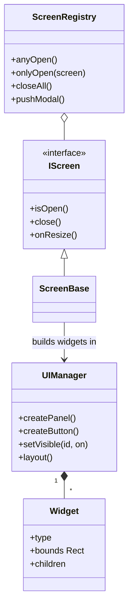

# Component: ui

## Responsibility

Owns the entire UI widget tree, all in-game screens, the baked-font text renderer,
procedural icons, theme tokens, notifications, the debug console and the screen lifecycle
registry. Interactive only; not compiled in headless builds.

## Key files

- [include/aoc/ui/UIManager.hpp:28](../../../include/aoc/ui/UIManager.hpp#L28) —
  `UIManager`: manages the widget tree stored as a flat vector with parent/children index
  links. Creates panels, buttons, labels, scroll lists, tab bars, progress bars, sliders,
  icons, rich text, portraits, and markdown widgets. Layout is computed top-down and drawn
  back-to-front; input is routed to focused widgets.
- [include/aoc/ui/Widget.hpp:367](../../../include/aoc/ui/Widget.hpp#L367) — `Widget`:
  type tag, bounds `Rect`, per-type data, children indices, enabled/visible flags.
- [include/aoc/ui/IScreen.hpp:22](../../../include/aoc/ui/IScreen.hpp#L22) — `IScreen`:
  the contract every modal screen or menu implements (`isOpen`, `close`, `onResize`,
  optional `themeOverride`). `ScreenBase`
  ([include/aoc/ui/GameScreens.hpp:29](../../../include/aoc/ui/GameScreens.hpp#L29))
  supplies the defaults for in-game screens.
- [include/aoc/ui/ScreenRegistry.hpp:28](../../../include/aoc/ui/ScreenRegistry.hpp#L28)
  — `ScreenRegistry`: the one list of registered `IScreen`s. `anyOpen` gates game input,
  `onlyOpen(screen)` is the exclusivity test for the non-blocking city panel, `closeAll`
  backs Esc, `onResize` fans out viewport changes; a small modal stack remembers the back path.
- [include/aoc/ui/BitmapFont.hpp](../../../include/aoc/ui/BitmapFont.hpp) /
  [FontAtlasFormat.hpp](../../../include/aoc/ui/FontAtlasFormat.hpp) — text rendering from
  the pre-baked, bounds-checked glyph atlas produced by `aoc_font_bake`; the game binary
  contains no TrueType parser.
- [include/aoc/ui/IconPainter.hpp](../../../include/aoc/ui/IconPainter.hpp) /
  [IconAtlas.hpp](../../../include/aoc/ui/IconAtlas.hpp) — procedural vector icons for
  yields, units, buildings and resources.
- [include/aoc/ui/Theme.hpp](../../../include/aoc/ui/Theme.hpp) /
  [StyleTokens.hpp](../../../include/aoc/ui/StyleTokens.hpp) /
  [Color.hpp](../../../include/aoc/ui/Color.hpp) — palette, spacing and font-scale tokens
  consumed by all widget draw paths; `MainMenuTheme.hpp` overrides them for the menu.
- [include/aoc/ui/Tooltip.hpp](../../../include/aoc/ui/Tooltip.hpp),
  [EventLog.hpp](../../../include/aoc/ui/EventLog.hpp),
  [Notifications.hpp](../../../include/aoc/ui/Notifications.hpp),
  [DebugConsole.hpp](../../../include/aoc/ui/DebugConsole.hpp),
  [WidgetInspector.hpp](../../../include/aoc/ui/WidgetInspector.hpp) — hover tooltips, the
  event feed, transient banners, the in-game console and the development widget inspector.

### Screen classes

All in `src/ui/` and `include/aoc/ui/`: `MainMenu`, `LoadingScreen`, `LoadGameMenu`,
`SettingsMenu`, `PauseMenu`, `GameScreens` (the in-game HUD screens), `CityDetailTabs`,
`CityListScreen`, `UnitListScreen`, `DiplomacyScreen`, `TradeScreen`,
`TradeRouteSetupScreen`, `ReligionScreen`, `EspionageScreen`, `GreatPeopleScreen`,
`GreatWorksScreen`, `HistoricMomentsScreen`, `DemographicsScreen`, `WorldCongressScreen`,
`CityStatesScreen`, `ClimateScreen`, `ScoreScreen`, `Encyclopedia`, `SpectatorHUD`, `Tutorial`.

## Public surface

- `UIManager` — created by `Application`; widgets added by each `IScreen` on open.
- `ScreenRegistry` — driven by `Application` for screen transitions.
- `GET /ui/tree` and the `POST /ui/*` routes expose the widget tree and clicks to the debug
  server through `UiControlCommand`.

## Internal structure

Flat directory. Screens are registered in `ScreenRegistry`; each builds its widget subtree
via `UIManager` calls on open and tears it down on close. Widgets are value types stored
contiguously; `UIManager` is the allocator and lifetime owner. Two outward edges exist:
`Tooltip.cpp` reads `render/CameraController`, and `LoadGameMenu.hpp` reads
`save/SaveSlots`.

## Core types

`UIManager` — [include/aoc/ui/UIManager.hpp:28](../../../include/aoc/ui/UIManager.hpp#L28);
`Widget` — [include/aoc/ui/Widget.hpp:367](../../../include/aoc/ui/Widget.hpp#L367);
`IScreen` — [include/aoc/ui/IScreen.hpp:22](../../../include/aoc/ui/IScreen.hpp#L22);
`ScreenBase` — [include/aoc/ui/GameScreens.hpp:29](../../../include/aoc/ui/GameScreens.hpp#L29);
`ScreenRegistry` — [include/aoc/ui/ScreenRegistry.hpp:28](../../../include/aoc/ui/ScreenRegistry.hpp#L28).

<!-- arch-doc: state-machines=none; no transitioned enum found -->
