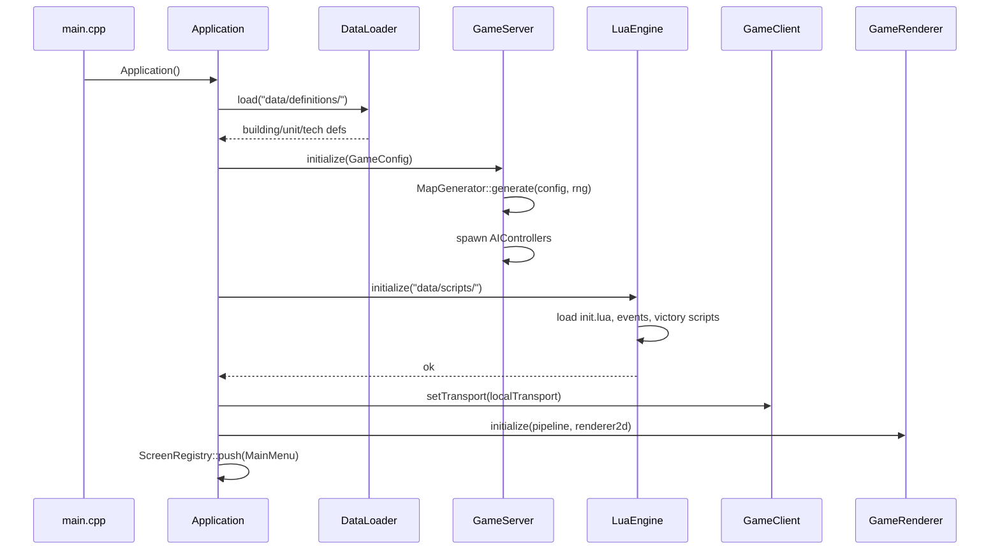
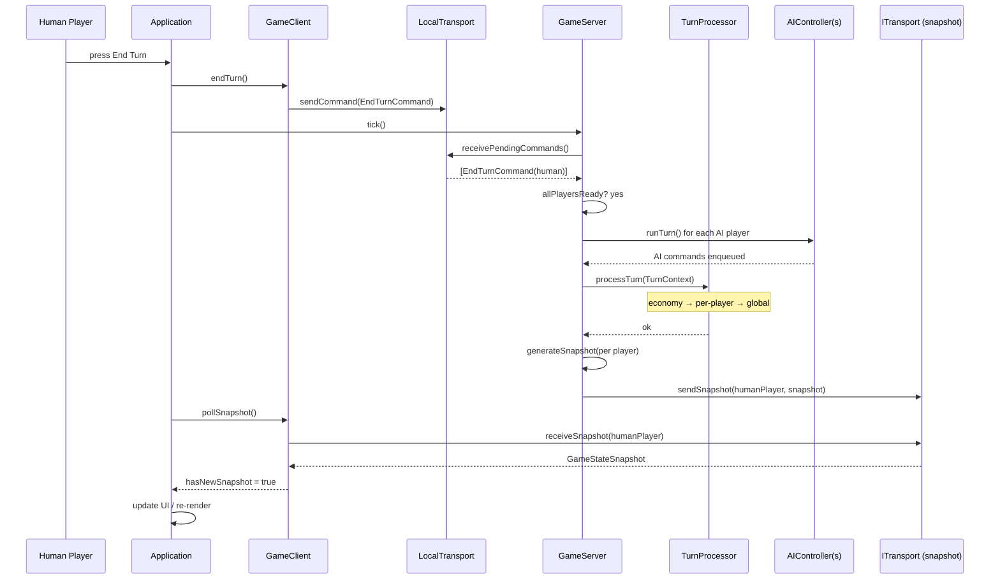
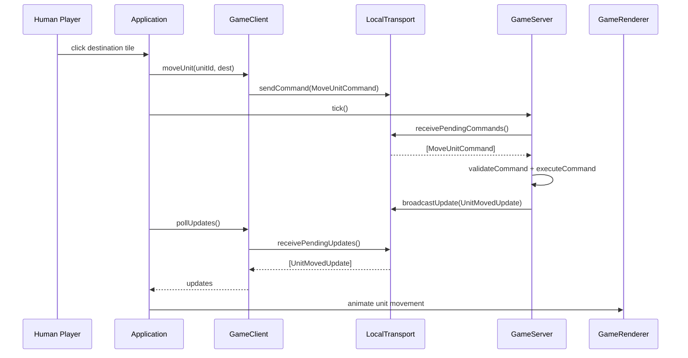
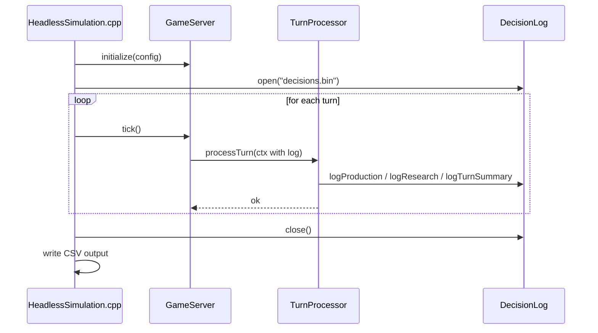
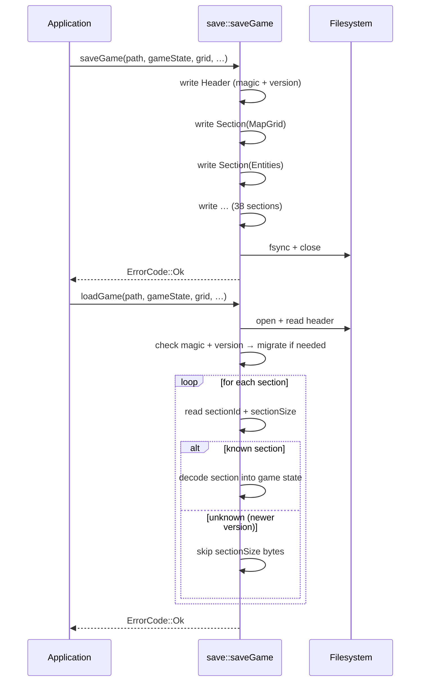

# Runtime Interaction Diagrams

## 1. Application startup (interactive build)

## 2. Player end-turn and simulation tick

## 3. Real-time action feedback (unit move)

## 4. Headless simulation (aoc_simulate)

## 5. Save and load

