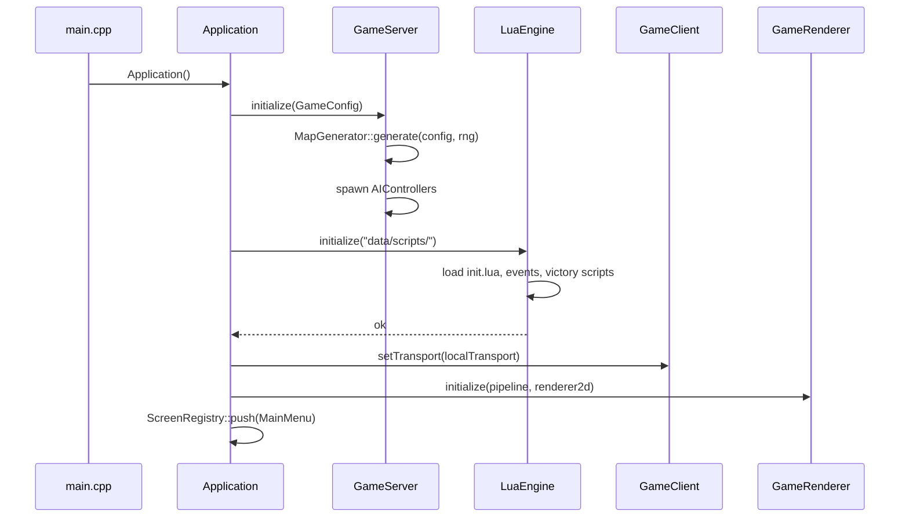
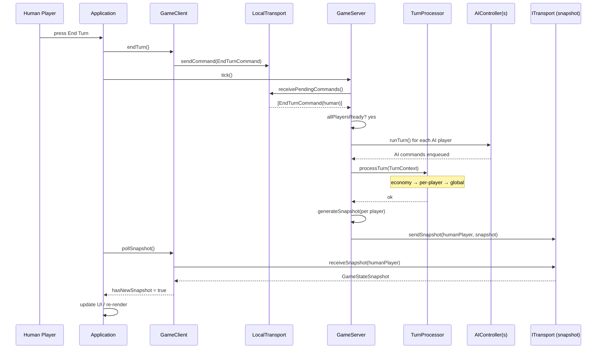
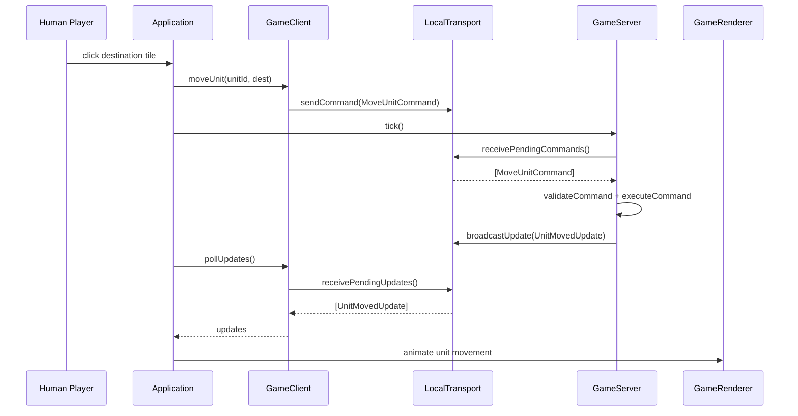
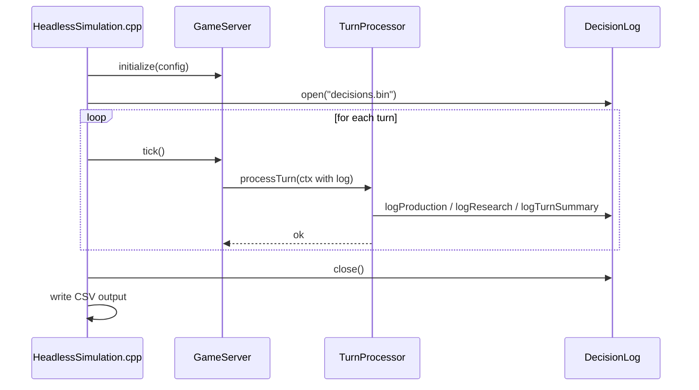
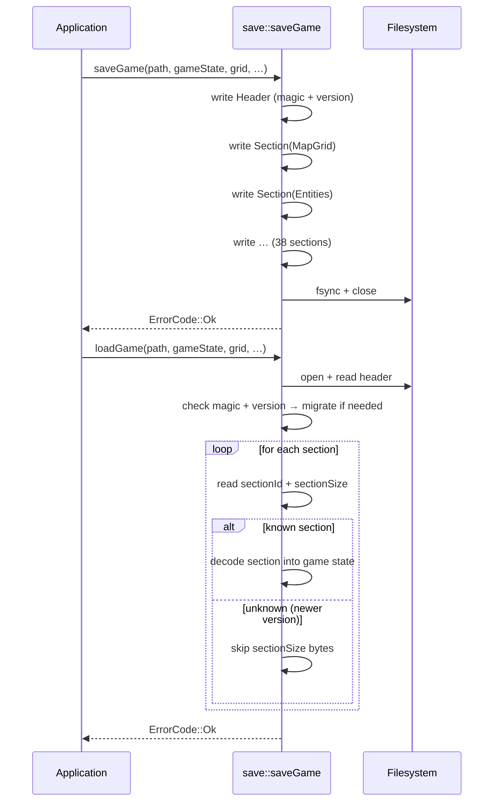

# Runtime Interaction Diagrams

## Entry points

Everything invocable from outside the process. `Kind` vocabulary: HTTP | CLI | queue |
scheduled | main | hook. This project has no queue consumers or scheduled jobs.

| Entry point | Kind | Defined at | Diagrammed |
|---|---|---|---|
| `age_of_civ` (interactive game) | main | src/main.cpp:38 | yes -- "1. Application startup (interactive build)" |
| `aoc_simulate` (headless sim) | main | src/tools/HeadlessSimulation.cpp:1171 | yes -- "4. Headless simulation (aoc_simulate)" |
| `aoc_mapgen` (map generator CLI) | main | src/tools/MapGenCli.cpp:199 | no -- single-shot MapGenerator::generate() + file writers |
| `aoc_trace_dump` (decision-log converter) | main | src/tools/TraceDump.cpp:103 | no -- linear file transform, one component |
| `aoc_evolve` (balance GA) | main | ml/cpp/main.cpp:389 | no -- batch driver looping aoc_simulate-style runs |
| GET /ping, /info, /plates, /tile | HTTP | src/tools/MapGenCli.cpp:650-697 | no -- read-only JSON views of the generated HexGrid |
| POST /dump/grid, /dump/plates | HTTP | src/tools/MapGenCli.cpp:721-754 | no -- file writers over the same grid state |
| POST /sim/re-roll, /sim/step, /sim/set-creator-time, /quit | HTTP | src/tools/MapGenCli.cpp:818-874 | no -- thin mutators re-invoking MapGenerator::generate() |
| GET /schema, /constants (debug server) | HTTP | src/app/Application.cpp:596,850 | no -- localhost dev inspection of live game state |

## Flows

## 1. Application startup (interactive build)

```mermaid
sequenceDiagram
  participant main as main.cpp
  participant app as Application
  participant srv as GameServer
  participant lua as LuaEngine
  participant cli as GameClient
  participant rnd as GameRenderer

  main->>app: Application()
  app->>srv: initialize(GameConfig)
  srv->>srv: MapGenerator::generate(config, rng)
  srv->>srv: spawn AIControllers
  app->>lua: initialize("data/scripts/")
  lua->>lua: load init.lua, events, victory scripts
  lua-->>app: ok
  app->>cli: setTransport(localTransport)
  app->>rnd: initialize(pipeline, renderer2d)
  app->>app: ScreenRegistry::push(MainMenu)
```
Anchors: `src/main.cpp`, `src/app/Application.cpp`

## 2. Player end-turn and simulation tick

```mermaid
sequenceDiagram
  participant human as Human Player
  participant app as Application
  participant cli as GameClient
  participant tr as LocalTransport
  participant srv as GameServer
  participant sim as TurnProcessor
  participant ai as AIController(s)
  participant net as ITransport (snapshot)

  human->>app: press End Turn
  app->>cli: endTurn()
  cli->>tr: sendCommand(EndTurnCommand)
  app->>srv: tick()
  srv->>tr: receivePendingCommands()
  tr-->>srv: [EndTurnCommand(human)]
  srv->>srv: allPlayersReady? yes
  srv->>ai: runTurn() for each AI player
  ai-->>srv: AI commands enqueued
  srv->>sim: processTurn(TurnContext)
  Note over sim: economy → per-player → global
  sim-->>srv: ok
  srv->>srv: generateSnapshot(per player)
  srv->>net: sendSnapshot(humanPlayer, snapshot)
  app->>cli: pollSnapshot()
  cli->>net: receiveSnapshot(humanPlayer)
  net-->>cli: GameStateSnapshot
  cli-->>app: hasNewSnapshot = true
  app->>app: update UI / re-render
```
Anchors: `src/app/Application.cpp`, `src/net/GameClient.hpp`, `src/net/GameServer.cpp`

## 3. Real-time action feedback (unit move)

```mermaid
sequenceDiagram
  participant human as Human Player
  participant app as Application
  participant cli as GameClient
  participant tr as LocalTransport
  participant srv as GameServer
  participant rnd as GameRenderer

  human->>app: click destination tile
  app->>cli: moveUnit(unitId, dest)
  cli->>tr: sendCommand(MoveUnitCommand)
  app->>srv: tick()
  srv->>tr: receivePendingCommands()
  tr-->>srv: [MoveUnitCommand]
  srv->>srv: validateCommand + executeCommand
  srv->>tr: broadcastUpdate(UnitMovedUpdate)
  app->>cli: pollUpdates()
  cli->>tr: receivePendingUpdates()
  tr-->>cli: [UnitMovedUpdate]
  cli-->>app: updates
  app->>rnd: animate unit movement
```
Anchors: `src/net/GameClient.hpp`, `src/net/Transport.hpp`, `src/net/GameServer.cpp`

## 4. Headless simulation (aoc_simulate)

```mermaid
sequenceDiagram
  participant main as HeadlessSimulation.cpp
  participant srv as GameServer
  participant sim as TurnProcessor
  participant log as DecisionLog

  main->>srv: initialize(config)
  main->>log: open("decisions.bin")
  loop for each turn
    main->>srv: tick()
    srv->>sim: processTurn(ctx with log)
    sim->>log: logProduction / logResearch / logTurnSummary
    sim-->>srv: ok
  end
  main->>log: close()
  main->>main: write CSV output
```
Anchors: `src/tools/HeadlessSimulation.cpp`

## 5. Save and load

```mermaid
sequenceDiagram
  participant app as Application
  participant save as save::saveGame
  participant fs as Filesystem

  app->>save: saveGame(path, gameState, grid, …)
  save->>save: write Header (magic + version)
  save->>save: write Section(MapGrid)
  save->>save: write Section(Entities)
  save->>save: write … (38 sections)
  save->>fs: fsync + close
  save-->>app: ErrorCode::Ok

  app->>save: loadGame(path, gameState, grid, …)
  save->>fs: open + read header
  save->>save: check magic + version → migrate if needed
  loop for each section
    save->>save: read sectionId + sectionSize
    alt known section
      save->>save: decode section into game state
    else unknown (newer version)
      save->>save: skip sectionSize bytes
    end
  end
  save-->>app: ErrorCode::Ok
```
Anchors: `src/save/Serializer.cpp`
