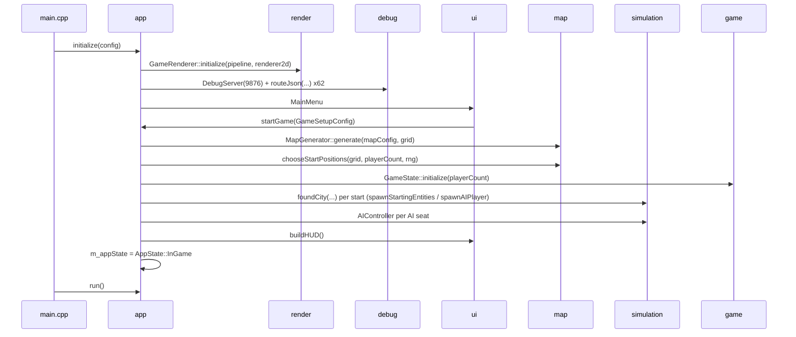
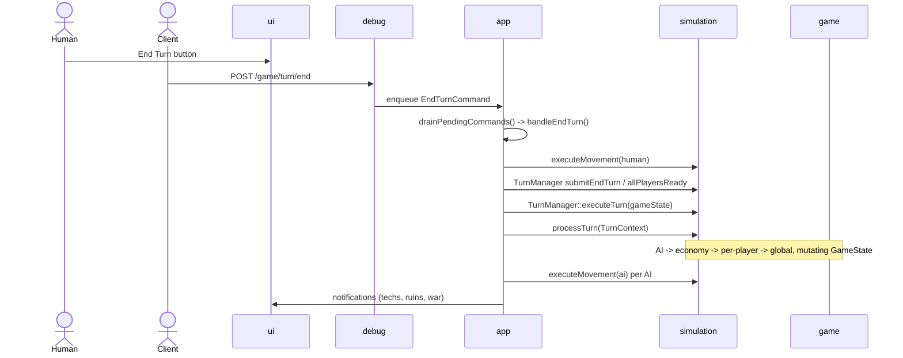
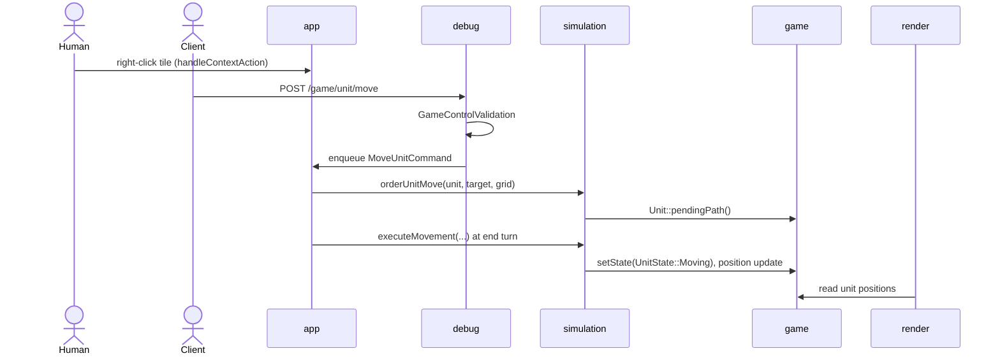
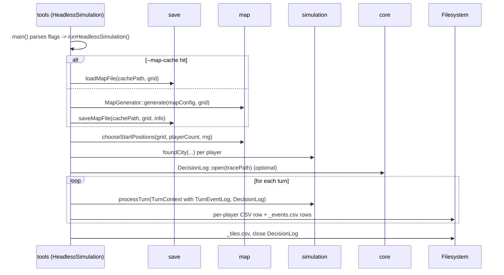

# Runtime Interaction Diagrams

## Entry points

Everything invocable from outside the process. `Kind` vocabulary: HTTP | CLI | queue |
scheduled | main | hook. This project has no queue consumers or scheduled jobs.

| Entry point | Kind | Defined at | Diagrammed |
|---|---|---|---|
| `age_of_civ` (interactive game; `--spectate`, `--enable-debug-server`, `--players`, `--turns`) | main | src/main.cpp:38 | yes -- "1. Interactive startup" |
| `aoc_simulate` (headless sim; `--turns`, `--players`, `--seed`, `--output`, `--map-cache`, `--trace-file`, …) | main | src/tools/HeadlessSimulation.cpp:1044 | yes -- "4. Headless simulation" |
| `aoc_mapgen` (map generator CLI) | main | src/tools/MapGenCli.cpp:279 | no -- single-shot MapGenerator::generate() + file writers |
| `aoc_trace_dump` (decision-log converter) | main | src/tools/TraceDump.cpp:103 | no -- linear file transform, one component |
| `aoc_font_bake` (glyph-atlas baker) | main | src/tools/FontBake.cpp:84 | no -- one-shot build-time rasteriser |
| `aoc_evolve` (balance GA) | main | ml/cpp/main.cpp:420 | no -- batch driver over embedded `runSimulation` runs |
| GET /ping, /info, /plates, /tile (aoc_mapgen inspector) | HTTP | src/tools/MapGenCli.cpp:749 | no -- read-only JSON views of the generated HexGrid |
| POST /dump/grid, /dump/plates (aoc_mapgen) | HTTP | src/tools/MapGenCli.cpp:814 | no -- file writers over the same grid state |
| POST /sim/re-roll, /sim/step, /sim/set-creator-time, /quit (aoc_mapgen) | HTTP | src/tools/MapGenCli.cpp:912 | no -- thin mutators re-invoking MapGenerator::generate() |
| GET /schema, /constants, /game/state, /game/player, /game/units, /game/cities, /game/diplomacy, /game/deals, /game/citystates, /game/city/district/sites (debug server) | HTTP | src/app/Application.cpp:602 (first of 39 routes); src/app/Application_CityControl.cpp:81 (first of 23) | no -- read-only JSON built from `GameSnapshot` and the live `GameState` |
| POST /game/turn/end | HTTP | src/app/Application.cpp:602 ff. | yes -- "2. End turn" (enqueues `EndTurnCommand`) |
| POST /game/unit/{move,attack,found-city,promote,alert,merge,nuke} | HTTP | src/app/Application.cpp:602 ff. | yes -- "3. Unit move order" (the `move` route; the rest follow the same queue) |
| POST /game/city/{production,purchase,focus,lock-tile,queue/remove,project,disposition,district/place}, /game/builder/{improve,chop,harvest}, /game/research, /game/policy/slot, /game/government/change, /game/governor/{assign,promote}, /game/greatperson/{activate,retire}, /game/greatwork/move, /game/religion/{pantheon,found}, /game/spy/mission, /game/congress/{vote,propose}, /game/deal/{propose,respond} | HTTP | src/app/Application.cpp:602 ff.; src/app/Application_CityControl.cpp:81 ff. | no -- each validates through `GameControlValidation` and enqueues one `GameControlCommand`; the drain is flow 2 |
| GET /ui/tree; POST /ui/click, /ui/click-at, /ui/scroll, /debug/screenshot | HTTP | src/app/Application.cpp:602 ff. | no -- `UiControlCommand` queue drained every frame |
| `aoc_*` MCP tools (60) | hook | tools/mcp_server.py:128 | no -- each is a thin HTTP client for one route above |
| `mcp_server.py` (stdio MCP server) | main | tools/mcp_server.py:709 | no -- wraps the debug server for an LLM client |
| `sim_health.py` | CLI | scripts/sim_health.py:346 | no -- offline checks over an `aoc_simulate` CSV |
| `mapgen_metrics.py`, `mapgen_render.py`, `earth_reference.py` | CLI | tools/mapgen_metrics.py:1545, tools/mapgen_render.py:164, tools/earth_reference.py:160 | no -- offline worldgen analysis over `aoc_mapgen` output |
| `mcp_e2e_test.py`, `check_grid_layers.py` | CLI | tools/mcp_e2e_test.py:382, scripts/check_grid_layers.py:105 | no -- test drivers |

## Flows

## 1. Interactive startup

```mermaid
sequenceDiagram
  participant main as main.cpp
  participant app
  participant render
  participant debug
  participant ui
  participant map
  participant simulation
  participant game

  main->>app: initialize(config)
  app->>render: GameRenderer::initialize(pipeline, renderer2d)
  app->>debug: DebugServer(9876) + routeJson(...) x62
  app->>ui: MainMenu
  ui->>app: startGame(GameSetupConfig)
  app->>map: MapGenerator::generate(mapConfig, grid)
  app->>map: chooseStartPositions(grid, playerCount, rng)
  app->>game: GameState::initialize(playerCount)
  app->>simulation: foundCity(...) per start (spawnStartingEntities / spawnAIPlayer)
  app->>simulation: AIController per AI seat
  app->>ui: buildHUD()
  app->>app: m_appState = AppState::InGame
  main->>app: run()
```
Anchors: `src/main.cpp`, `src/app/Application.cpp`

`main` parses flags and calls `Application::initialize` (`src/main.cpp:73`) then `run`
(`:90`). `initialize` (`src/app/Application.cpp:307`) sets up the window and renderer
(`:365`) and, with `--enable-debug-server`, creates the server (`:582`) and registers its
routes (`:602` onward). `startGame` (`:2044`) generates the map (`:2129`), picks starts
(`:2177`), spawns the human (`:2189`) and one `AIController` per AI seat, builds the HUD and
enters `InGame` (`:2286`).

## 2. End turn

```mermaid
sequenceDiagram
  actor Human
  actor Client
  participant ui
  participant debug
  participant app
  participant simulation
  participant game

  Human->>ui: End Turn button
  Client->>debug: POST /game/turn/end
  debug->>app: enqueue EndTurnCommand
  app->>app: drainPendingCommands() -> handleEndTurn()
  app->>simulation: executeMovement(human)
  app->>simulation: TurnManager submitEndTurn / allPlayersReady
  app->>simulation: TurnManager::executeTurn(gameState)
  app->>simulation: processTurn(TurnContext)
  Note over simulation,game: AI -> economy -> per-player -> global, mutating GameState
  app->>simulation: executeMovement(ai) per AI
  app->>ui: notifications (techs, ruins, war)
```
Anchors: `src/app/Application.cpp`, `src/simulation/turn/TurnProcessor.cpp`

The REST route and the HUD button meet in `drainPendingCommands` (`src/app/Application.cpp:2996`),
which runs on the main thread and calls `handleEndTurn` (`:7111`). That moves the human's
units (`:7161`), submits end-turn to the `TurnManager`, and when every seat is ready calls
`processTurn` (`:7214`) followed by AI movement (`:7218`). There is no server or transport in
this path; the same `TurnContext` shape is built for spectator games (`:2410`).

## 3. Unit move order

```mermaid
sequenceDiagram
  actor Human
  actor Client
  participant app
  participant debug
  participant simulation
  participant game
  participant render

  Human->>app: right-click tile (handleContextAction)
  Client->>debug: POST /game/unit/move
  debug->>debug: GameControlValidation
  debug->>app: enqueue MoveUnitCommand
  app->>simulation: orderUnitMove(unit, target, grid)
  simulation->>game: Unit::pendingPath()
  app->>simulation: executeMovement(...) at end turn
  simulation->>game: setState(UnitState::Moving), position update
  render->>game: read unit positions
```
Anchors: `src/app/Application.cpp`, `src/simulation/unit/UnitOrders.cpp`, `src/simulation/unit/Movement.cpp`

The click path lives in `handleContextAction` (`src/app/Application.cpp:6683`, the order at
`:7067`); the REST path arrives as a `MoveUnitCommand` executed at `:2708`. Both call
`orderUnitMove`, which stores a path on the `Unit`; `executeMovement`
(`src/simulation/unit/Movement.cpp:329` marks the unit `Moving`) walks it when the turn ends.

## 4. Headless simulation

```mermaid
sequenceDiagram
  participant tools as tools (HeadlessSimulation)
  participant save
  participant map
  participant simulation
  participant core
  participant fs as Filesystem

  tools->>tools: main() parses flags -> runHeadlessSimulation()
  alt --map-cache hit
    tools->>save: loadMapFile(cachePath, grid)
  else
    tools->>map: MapGenerator::generate(mapConfig, grid)
    tools->>save: saveMapFile(cachePath, grid, info)
  end
  tools->>map: chooseStartPositions(grid, playerCount, rng)
  tools->>simulation: foundCity(...) per player
  tools->>core: DecisionLog::open(tracePath) (optional)
  loop for each turn
    tools->>simulation: processTurn(TurnContext with TurnEventLog, DecisionLog)
    tools->>fs: per-player CSV row + _events.csv rows
  end
  tools->>fs: _tiles.csv, close DecisionLog
```
Anchors: `src/tools/HeadlessSimulation.cpp`

`main` (`src/tools/HeadlessSimulation.cpp:1044`) calls `runHeadlessSimulation` (`:322`),
which reuses a cached `.aocmap` or generates and caches the map (`:395-410`), places starts
(`:455`), founds one city per player (`:475`), optionally opens the decision trace (`:651`),
and loops `processTurn` (`:685`). No `GameServer` is involved.

## 5. Save and load

```mermaid
sequenceDiagram
  participant app
  participant save
  participant fs as Filesystem

  app->>save: saveGame(path, gameState, grid, turnManager, economy, diplomacy, fog, rng)
  save->>save: header (magic, CURRENT_SAVE_VERSION = 34)
  save->>save: 41 write*Section() calls (44 SectionId values)
  save->>fs: write path.tmp, fsync
  save->>fs: rename(path.tmp, path), fsync(dir)
  save-->>app: ErrorCode::Ok

  app->>save: loadGame(path, ...)
  save->>fs: read whole file
  save->>save: check magic; version must equal CURRENT_SAVE_VERSION (no migration)
  loop for each section
    save->>save: read sectionId + sectionSize
    alt known section
      save->>save: decode; size mismatch -> SaveCorrupted
    else unknown
      save->>save: skip sectionSize bytes
    end
  end
  save-->>app: Ok | SaveVersionMismatch | SaveCorrupted
```
Anchors: `src/save/Serializer.cpp`, `src/app/Application.cpp`

Callers: manual save/load and slot menus (`src/app/Application.cpp:4389`, `:4424`, `:4617`,
`:4632`) and quicksave (`:5366`). The atomic write is `src/save/Serializer.cpp:2191-2267`;
the version gate is `:2329-2337`.
