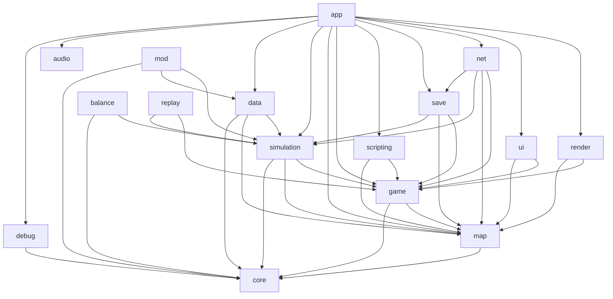

# Age of Civilization — Architecture Overview

Age of Civilization is a C++20 4X strategy game (hex map, plate-tectonics worldgen, deep
economy/AI simulation) built as a single static library `aoc_lib` with four executables:
`age_of_civ` (interactive, Vulkan + GLFW), `aoc_simulate` (headless turn simulation),
`aoc_trace_dump` (AI decision log converter), and `aoc_mapgen` (standalone map generator).
The CMake `-DAOC_HEADLESS=ON` flag strips Vulkan/GLFW from the library so the headless tools
build without a display.

**core** provides the foundational vocabulary the rest of the codebase shares: strong entity
and type identifiers, a deterministic PRNG, structured logging, and a compact binary
decision-log for AI tracing.

**game** owns the top-level runtime entity objects — `GameState`, `Player`, `City`, `Unit` —
that simulation, rendering, and networking all read and write through typed accessors.

**map** stores the hex tile grid as parallel SoA arrays and provides coordinate math,
terrain definitions, fog of war, pathfinding, and a full plate-tectonic map generator with
a Mollweide-projected sphere, climate, river, and resource placement pipeline.

**simulation** is the game's domain layer: 20+ independent sub-modules covering AI
decision-making, economy/trade, diplomacy, city management, unit combat, technology,
religion, culture, government, production chains, monetary policy, barbarians, climate,
victory conditions, and the authoritative `TurnProcessor` that sequences them each turn.

**render** drives Vulkan rendering via the `vulkan_renderer` submodule and produces all
visual output: the hex map, unit sprites, combat animations, globe view, minimap, and
overlays. It is excluded entirely in headless builds.

**ui** owns the widget tree, all in-game screens, font rendering (stb_truetype), theme,
localization, and the screen lifecycle registry. Interactive only.

**net** defines the server/client architecture (even in single player): `GameServer` owns
all game state and drives the sim; `GameClient` sends commands; `ITransport`/`LocalTransport`
connect them in-process. Future multiplayer replaces `LocalTransport` with a network
adapter.

**save** serializes the complete game state to a versioned binary format (currently v10 with
38 sections), with forward-compatible section skipping and a migration chain from v1.

**scripting** wraps LuaJIT (or Lua 5.4) to let Lua scripts define victory conditions, world
events, AI overrides, and map rules. Compiles to a no-op stub when Lua is absent.

**data** loads JSON definitions for buildings, units, techs, recipes, goods, and leader
personalities from `data/definitions/` at startup, with compile-time constexpr fallbacks.

**debug** provides a single-file localhost HTTP server (cpp-httplib) for live game-state
inspection during development.

**app** is the interactive entry point: GLFW window lifetime, the main game loop, input,
hotkeys, unit selection, and screenshot capture.

**audio** is a stub backend wired to miniaudio when `AOC_AUDIO_ENABLED` is defined;
currently a no-op.

**balance/ml** exposes tunable game constants (`BalanceParams`) as a float genome and
provides a genetic algorithm in `ml/cpp/` that runs headless simulations in parallel to
tune those constants automatically.

**mod** is a placeholder `ModLoader` that will load mod JSON definitions; all methods
currently log a warning and return false.

**replay** records per-turn per-player snapshots (score, population, military, techs) for
post-game analysis.

