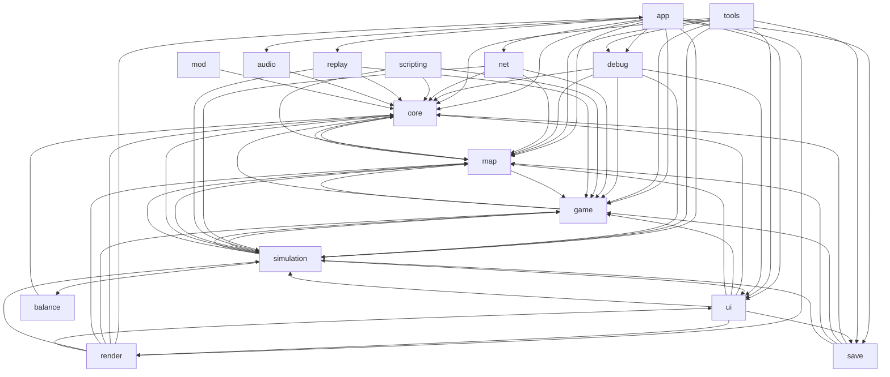

# Age of Civilization — Architecture Overview

Age of Civilization is a C++20 4X strategy game (hex map, plate-tectonics worldgen, deep
economy/AI simulation) built as a single static library `aoc_lib` with five executables:
`age_of_civ` (interactive, Vulkan + GLFW), `aoc_simulate` (headless turn simulation),
`aoc_trace_dump` (AI decision-log converter), `aoc_mapgen` (standalone map generator with a
loopback HTTP inspector), and `aoc_font_bake` (build-time glyph-atlas baker). The CMake
`-DAOC_HEADLESS=ON` flag strips Vulkan/GLFW from the library so the headless tools build
without a display. The balance tuner `aoc_evolve` (`ml/cpp/`) links `aoc_lib` separately.

**core** provides the foundational vocabulary the rest of the codebase shares: strong entity
and type identifiers, a deterministic PRNG, structured logging, a compact binary decision log
for AI tracing, JSON string escaping, order-independent reductions over hash-ordered
containers, and the `Selectable` interface for map objects.

**game** owns the top-level runtime entity objects — `GameState`, `Player`, `City`, `Unit` —
that simulation, rendering, saving and the debug API all read and write through typed
accessors, plus zone-of-control queries. Since save v34 `GameState` also owns the deals in
force, so the turn processor, the AI, the UI and the save file see one list.

**map** stores the hex tile grid as parallel SoA arrays and provides coordinate math,
terrain definitions, fog of war, pathfinding, start placement shared by the game and the
headless tool, and a physics-first plate-tectonics map generator: a 720×360 lat/lon raster
simulation (rigid-plate advection, terranes riding their plates on a prescribed Wilson-cycle
schedule, subduction fronts, continental docking, plate-contiguity enforcement, Airy isostasy
with oceanic thermal subsidence, and a fixed-ocean-volume sea level) projected onto the hex
grid and refined by margin, relief, climate, river, lake and resource placement passes.

**simulation** is the game's domain layer: 24 sub-modules covering AI decision-making,
economy/trade, diplomacy, city management, unit combat and orders, technology, religion,
culture, government, production chains, monetary policy, barbarians, city-states, climate,
victory conditions, and the authoritative `TurnProcessor` that sequences them each turn. A
request layer (`CityActions`, `UnitOrders`, `AttackRequest`, `BuilderActions`,
`DiplomacyActions`, `DealProposals`, `MonetaryActions`) validates every mutation once, so the
human UI, the AI, the REST API and the MCP tools share one code path.

**render** drives Vulkan rendering via the `vulkan_renderer` submodule and produces all
visual output: the hex map, unit sprites, combat animations, globe view, minimap, overlays and
per-player colours. It is excluded entirely in headless builds.

**ui** owns the widget tree, all in-game screens, the baked-font text renderer (no TrueType
parser at runtime), procedural vector icons, theme tokens, notifications, the debug console
and the screen lifecycle registry. Interactive only.

**net** defines a server/client split (`GameServer`, `GameClient`, `ITransport`,
`LocalTransport`) that no executable currently instantiates: the interactive game and the
headless tool both drive `TurnProcessor` directly. It also hosts the Linux D-Bus desktop
integration (`GameDBus`).

**save** serializes the complete game state to a versioned binary format (currently v34 with
44 section ids), written atomically and loaded only on an exact version match (no migration
chain). It also owns the `.aocmap` map-cache file format and the save-slot naming.

**scripting** wraps LuaJIT (or Lua 5.4) to let Lua scripts define victory conditions, world
events, AI overrides, and map rules. Compiles to a no-op stub when Lua is absent.

**debug** provides the loopback HTTP server (cpp-httplib) and the typed game-control and
UI-control command vocabulary behind it: 62 REST routes that read a per-player
`GameSnapshot` or enqueue validated commands for the main thread, wrapped by
`tools/mcp_server.py` as 60 MCP tools.

**tools** holds the four non-interactive executables: the headless simulator, the map
generator CLI, the decision-log converter and the font baker.

**app** is the interactive entry point: GLFW window lifetime, the main loop, input and unit
selection, the REST command queues drained on the main thread, spectator mode, and the
`MainMenu`/`InGame` application state.

**audio** is a stub backend wired to miniaudio when `AOC_AUDIO_ENABLED` is defined;
currently a no-op.

**balance/ml** exposes tunable game constants (`BalanceParams`) as a float genome and
provides a genetic algorithm in `ml/cpp/` that runs embedded headless simulations in
parallel to tune those constants and leader personalities, scored through `BalanceMetrics`.

**mod** is a placeholder `ModLoader` that will load mod JSON definitions; all methods
currently log a warning and return false.

**replay** records per-turn per-player snapshots (score, population, military, techs) for
post-game analysis.

<!-- arch-doc: layers=flat; no layering declared in directory or manifest naming (dependency graph is layered de-facto but the code names no layers) -->

```mermaid
graph TD
  app --> audio
  app --> core
  app --> debug
  app --> game
  app --> map
  app --> net
  app --> render
  app --> replay
  app --> save
  app --> simulation
  app --> ui
  tools --> core
  tools --> debug
  tools --> game
  tools --> map
  tools --> save
  tools --> simulation
  tools --> ui
  render --> app
  render --> core
  render --> game
  render --> map
  render --> simulation
  render --> ui
  ui --> core
  ui --> game
  ui --> map
  ui --> render
  ui --> save
  ui --> simulation
  debug --> core
  debug --> game
  debug --> map
  debug --> simulation
  debug --> ui
  net --> core
  net --> game
  net --> map
  net --> simulation
  save --> core
  save --> game
  save --> map
  save --> simulation
  scripting --> core
  scripting --> game
  scripting --> map
  replay --> core
  replay --> game
  replay --> simulation
  simulation --> balance
  simulation --> core
  simulation --> game
  simulation --> map
  simulation --> ui
  game --> core
  game --> map
  game --> simulation
  map --> core
  map --> game
  map --> simulation
  core --> map
  audio --> core
  mod --> core
  balance --> core
```

Edges are the `#include "aoc/<subsystem>/"` relations present in `src/` and `include/`
today, drawn as they exist. The cross-layer ones: `core → map` through
`include/aoc/core/Selectable.hpp:13`; `map → game` through `src/map/Pathfinding.cpp:8` and
`src/map/RiverGameplay.cpp:7`; `render → app` through `src/render/CameraController.cpp:7`;
`simulation → ui` through the three AI controller headers that include
`aoc/ui/MainMenu.hpp` (`include/aoc/simulation/ai/AIBuilderController.hpp:9`);
`ui → render` through `src/ui/Tooltip.cpp:18`; `ui → save` through
`include/aoc/ui/LoadGameMenu.hpp:8`; `simulation → balance` through
`src/simulation/city/CityLoyalty.cpp:9`.
